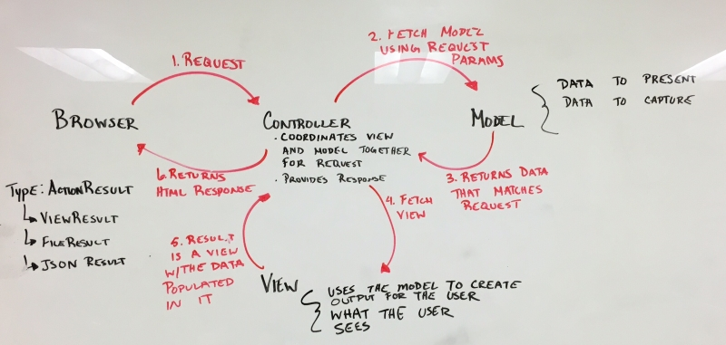

# MVC Views Part 2

## Problem Statement

Web pages often use the same layout page for different data.

For example:

- a site like **LinkedIn** shows profiles for millions of users
- a site like **Twitter** shows millions of tweets
- a site like **Amazon** shows a product page for millions of products

Also, consider the fact that web sites also allow users different ways to view the data. Sometimes users like to look at things in an *image view* and others might prefer the *text-based view*.

We will use views and models together to show how a model can be bound to a particular view, allowing it to render the different properties of the model.

## Lesson Objectives

- MVC Request Workflow
- Request Objects(Java)
- Model Binding (.NET)

## Notes and Examples

### Review MVC Request Workflow

<div class="caution note">Do not need to go into the entire workflow yet.</div>

Important parts to understand in the MVC Request Workflow

1. A url request is *routed* to a controller.
2. The controller receives the request and *invokes a specific action to handle the request*.
3. The action determines which model and view is necessary for the response.
4. The response generated from the controller is sent to the browser or client that issued the request.  



### Request Objects (Java)

ASP.NET MVC and Spring MVC provide access to the inbound request object.

<div class="definition note">

The **request object** contains data sent by the client and is used to communicate information to the web server. It is what the controller uses to get data to the view.</div>

- **Attributes in the request object**   
    - Querystring parameters
    - Form values
    - Cookie data

### Model Binding (Java)

- URL and HTML encoding
- Request Object
    - Request scoped variables
        - requestScope is NOT the same as the request object
        - requestScope is an instance of java.util.Map that holds the key value pairs for all of the request attributes
        - requestScope variables can be referenced without actually qualifying them.
- EL dot operator
    - The EL dot operator can be used to access “JavaBeans properties” or elements of a Map
    - The dot operator cannot be used to invoke methods (except for JavaBeans getters and setters implicitly)
- JavaBeans
    - The JavaBeans conventions make it easier to write generic functionality around data classes.
    - properties
        - getters
        - setters
- JSTL 
    - <c:foreach /> (continued...)
    - <c:out />
    - formatting tags??? (self-study?)
- Scriptlets

- **Displaying a dynamic value**
    - JSP Expressions

<div class="definition note">

<span>JSP expressions</span> can be used to display the value of Java expressions.  The syntax is to write a Java expression inside JSP expression tags: `<%= request.getParameter("foo") %>`</div>

- **Dynamic Logic Within a Page**
    - Sometimes the dynamic functionality of our web pages requires a calculation to be performed, or some kind of control flow logic.  In these cases, we can use **JSP Scriptlets** to embed Java code within our page.
    
<div class="definition note">

A **JSP Scriptlet** allows us to embed Java code for dynamically generating HTML output into our JSP file.</div>

```
<%
    String greeting = "";
    String language = request.getParameter("lang");
    if(language.equals("FR")) {
        greeting = "Bonjour monde";
    } else if(language.equals("ES")) {
        greeting = "Hola mundo";
    } else if(language.equals("DE") {
        greeting = "Hallo Welt"
    } else {
        greeting = "Hello World";    
    }
%>
<h1><%= greeting %></h1>
```


### Model Binding (.NET)

<div class="caution note">

Stress the importance of the design pattern and following it. It is not critical to understand the pattern at this point.</div>

- **ASP.NET View Conventions**
    - Each controller folder contains a view file for each Action method. 
    - Files are name the same for each action method.
    - The View Selection process starts by looking for a view in the folder `Views/ControllerName`
    - We can override this by indicating the name of the view in the `return View();`

- **Model Binding**
    - Controller needs to provide information to a view. It passes a data transfer object called a *model*.
    - Views are capable of transforming a model into a format to be presented to the user.        
    - In order to display a model, the controller needs to **pass the model to the view**.

<div class="definition note">

A **model** is the object stored in the database. It performs business calculations or contains properties that are rendered in a view.</div>

- **Passing a Model to a View in ASP.NET MVC**
    - The controller is responsible for locating the correct model and passing it along to the view.
    ```
    public ActionResult Index()
    {
        var model = new Car();
        model.Make = "Ford";
        return View("Index", model);
    }
    ```

    - In the view we bind it to a model by typing
    ```
    @model FullNamespace.ClassName
    ```
        
- The only logic that should be included in the View is logic that is truly related to presentation


