# Intro to Relational Database Design

## What is Relational Database Design?

Relational Database Design (RDD) models information and data into a set of tables with rows and columns under the rules of the Relational Data Model.  

A proper Relational Database design will eliminate data redundancy. i.e. the same piece of data will not be stored in more than one place. Duplicate data not only wastes storage space but also can easily lead to inconsistencies.

Relational Database design will also ensure data integrity and accuracy. The ACID (**A**tomicity, **C**onsistency, **I**ntegrity and **D**urability) properties will all be successfully implemented.

### **Overview**

The Relational Data model and SQL are not new.

The Relational Data model was proposed by E.F. Codd of IBM Research, in June, 1970 in a paper entitled ["A Relational Model of Data for Large Shared Data Banks "](https://www.seas.upenn.edu/~zives/03f/cis550/codd.pdf). It is currently the dominant database model for commercial applications. There are many commercial Relational Database Management System (RDBMS), such as Oracle, IBM DB2 and Microsoft SQL Server.  As well as many free and open-source RDBMS, such as PostgreSQL and MySQL.

A relational database organizes data in tables (or relations). A table is made up of rows and columns. A row is also called a record (or tuple). A column is also called a field (or attribute). A database table is similar to a spreadsheet. However, unlike a spreadsheet, the relationships that can be created among the tables enable a relational database to efficiently store huge amount of data, and effectively retrieve selected data.

Structured Query Language (SQL), which was designed to work with relational databases, was first developed in the 1970s by IBM researchers Raymond Boyce and Donald Chamberlin.

### **Typical Steps When Implementing a Relational Database**

* **Data Modeling** - The process of clearly and precisely defining the data items to store, their purpose and use.

* **Logical Design** - Creating a design that follows the rules of the Relational Data Model.

* **Physical Design** - Adjusting the Logical Design to meet requirements related to performance, ease of use, hardware and software (RDBMS) limitations, etc.  Intelligent violation of the Relational Data Model.

* **Physical Implementation** - The creating of the tables and supporting objects such as sequences, indexes, views and alias' as well as the granting of various privileges on the tables or column.

* **Administration** - Various ongoing tasks related to keeping the Relational Database valid and performing well.  Activities include monitoring access, performing periodic backups, performance enhancements such as reorgs and validity checking, adjusting and creating indexes, granting and revoking privileges on the Database.  These activities are generally assigned to a Database Administrator.

**Note**: We will only be addressing Data Modeling and Logical Design and even then, in an overview fashion.

### **Terms To Be Familiar With**

* **Table:** A set of related rows.

* **Row:** A set of related columns.

* **Column:** A fact/element of data

* **Primary Key:** A column or set of columns that uniquely identifies a row in a table.

* **Foreign Key:** A column or set of columns in a table that match the entire Primary Key of another table.  Foreign Keys are used to establish the relationships between tables.

* **Parent Table:** A table whose Primary Key is matched by Foreign Keys in one of more other tables.  

* **Dependent Table:** A table whose rows are dependent on an existing row in another table.  The Foreign Key of a dependent matches the entire Primary Key of it's parent.

* **Referential Integrity:** Enforcement of the Parent/Dependent relationship by assuring every Foreign Key row in a Dependent Table has a matching Primary Key row in it's Parent Table.  Also defines how changes to the Parent or Dependent tables should be reflected in the other.

## Sample Application - Tach Escalator

To illustrate the relational design process we will create a simple relational Database design for a hypothetical programming training school called Tach Escalator.

Information regarding the application and illustration of a relational design process for it follows.

## A Simple Process for Performing Relation Database Design

Here is a simple process for creating a good relational design.  Each step will be presented and discussed in turn.

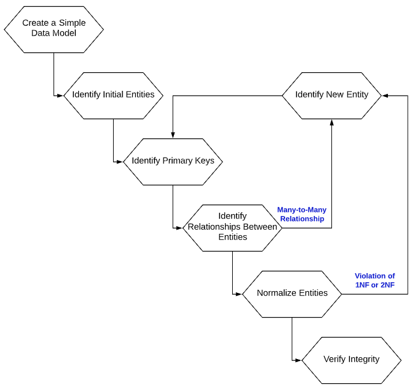

### **Create a Simple Data Model**

In order to create a proper and effective relational Database design one must start with at least a simple model of the data items to be stored and the business rules applicable to them.

A simple list of data items and a brief summary of what they mean and how they are used may be enough to start.

Our contacts at Tach Escalator, Hugh Anthonies and Wynn Davtrich, have provided us with the following information concerning how they work and the data they would like stored for their system:

1. Tach Escalator's motto is "Moving your career along at a safe, reasonable, pace".  This would seem to indicate they are very risk averse and would like a simple, straight-forward and safe implementation.

2. There are several Tach Escalator locations across the U.S.A. each with their own unique internal identification code.

3. Each location may conduct one or several of the various courses they offer (cohort), but no more that one course may be conducted simultaneously at any one location. i.e. Only one Java cohort can be offered at a time at any one location, although each location may have a Java cohort.

4. Instructors are based at only one location, but may teach at any location.

5. Students may only attend one cohort at one location at a time. If a Student decides to attend another cohort sometime, they will be treated as a new, separate student.

6. The maximum number of students for a cohort may vary from location to location.

7. We need to know the current number of enrollments for any one cohort as well as how many students graduated each cohort.

8. Our Location Directors want to be able to store notes/comments about each cohort.

Following are the data items to be stored and some information regarding them:

| Data Item | Use and Business Rules|
|-----------|-----------------------|
|Student Name| Full name of student |
|Student Address| Full Address of student; Street, City, State, Zip Code|
|Student Status| Current status (Enrolled, Interviewing, Graduated, Applying, Rejected, Other)|
|Notes| Any notes a staff member may have regarding the student |
|Course Name| Name of a course|
|Course Duration| Duration of the course|
|Location City|
|Location State| Standard USPS state code |
|Location Open Date| mm/dd/yyyy format|
|Instructor First Name|
|Instructor Last Name|
|Instructor Middle Name|
|Home Location of Instructor|
|Cohort Start Date|mm/dd/yyyy format|
|Cohort Graduation Date|mm/dd/yyyy format|

### **Identify Main Entities**

An entity is a table, so all we are doing here is trying to identify the main tables in our design.  This step should not take long.  

Don't try to think of all the entities/tables you might need just a few to start with.  You will see that the process will help us identify other entities/tables as we move through it.

A good question to ask is: "*What do I want to keep track of?*".

For our sample application we may think of these first:

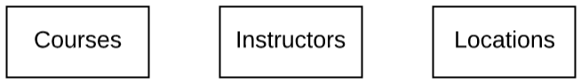

### **Identify Primary Keys**

In the relational model, a table cannot contain duplicate rows. To ensure uniqueness, each table should have a column (or a set of columns), called a Primary Key, that uniquely identifies entries in the table. A Primary Key may be called a simple key if it is a single column or a composite key if it is made up of several columns.

Required characteristics of a Primary Key:

* The values of primary key must be unique.

* The primary key must always have a value. i.e.  it cannot be NULL.

Desirable characteristics of a Primary Key:

* The Primary Key should be simple and familiar, e.g., employeeID for employees table; accountNumber for a customers table.

* The value of the Primary Key should not change. Primary Key may be referenced by other tables (more later). If the value of a Primary Key changes, all references must also be changed.

* Primary Key values are often integers (or numeric),  but could also be other types, such as text or string.

* Primary Keys may be generated values. Most RDBMSs support some form of auto-incrementing values that may be used as a Primary Key.

For our sample application:

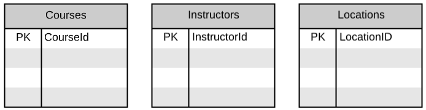

### **Identify Relationships Between Entities**

A fundamental characteristic of a Relational Database Management System (RDBMS) is that the tables can be related to each other.

The relationships that may exist between tables include:

**one-to-one** where for each entry in one table there is exactly one matching entry in another table.  It is not unusual in a one-to-one relationship for the tables involved to have the same Primary Key.

**one-to-many** where for each entry in one table (parent) there may be many matching entries in another  table (dependent).

This is the goal in Relational Database Design.

**many-to-many** where for each entry in one table there can be many matching entries in another table.

How to handle each relationship at this point in the design:
| Relationship | What to do|
|-----------|-----------------------|
|one-to-one| Combine tables into one table|
|one-to-many| Do nothing - this is the goal|
|many-to-many| Break the relationship into a pair of one-to-many relationships by creating a new entity (relator) with a primary key containing the primary keys of the two entities|

Example - Step A - Identify initial relationships:

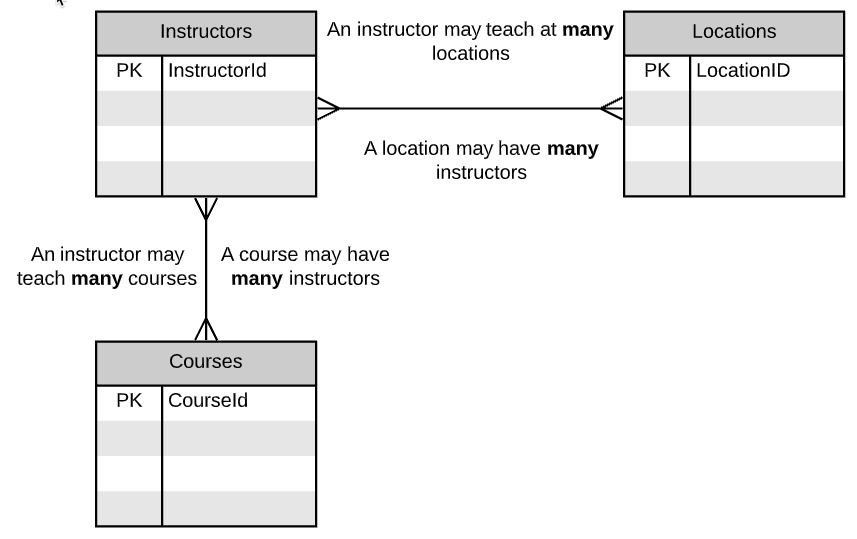

Example - Step B - Handle many-to-many relationships by creating a new entity, giving it the Primary Keys of the original entities and establishing the one-to-many relationships with the original entities:

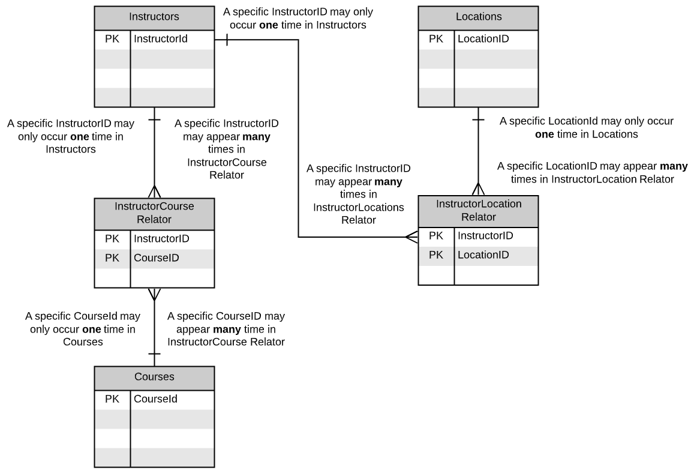

Note: More meaningful names for the relator entities may become apparent after the Normalization process.

### **Logical Design - Normalization**

Logical Design is the process of creating a design that adheres to the rules of the Relational Data Model.

Normalization is a Logical Database Design technique which organizes tables in a manner that reduces redundancy and dependency of data. It generally produces a number of smaller tables and links them using relationships.

E.F. Codd created the theory of data placed in normal forms (NF). He originally devised three normal forms which have since grown to six (or seven). The goal of normalization in relational Database design to achieve **Third Normal Form** (*3NF*).

Each data item in a table is considered an atomic, stand alone, fact.

* **First Normal Form** (*1NF*): For each entity, create a separate
entity for repeating data groups. No fact may repeat in a table.

* **Second Normal Form** (*2NF*): For each entity, create a separate entity for data elements that are based on a portion of the primary key. Each data item must be a based on the entire primary key of the table.

* **Third Normal Form** (*3NF*): For each entity, create a separate entity for data elements that are based on some other data element. Each data item must be based on only the primary key.

The normal forms are cumulative. You must be 1NF to be in 2NF and you must be in 2NF to be in 3NF.

A simple way to determine if you are in 3NF is to place a data item in a table and ask two questions:

1. *Is the fact/data element already in the table?*  If the answer is "*No*" you are in 1NF.

2. Is it a fact about the key, the whole key and nothing but the key (so help you Codd)? If the answer is "*Yes*" you are in 3NF.

     *(About the key, the whole key checks 2NF; Nothing but the key checks 3NF)*

If either of the questions results in the "wrong" answer:

1. Look for an existing table where the data item does fit.

2. Create a new table to hold the data item.
Note: When you create the new table you must also follow the subsequent steps in the process (Designate primary keys and establish relationships) before continuing to another data item.

Students attend courses so the Courses table seems like the place for Student information:

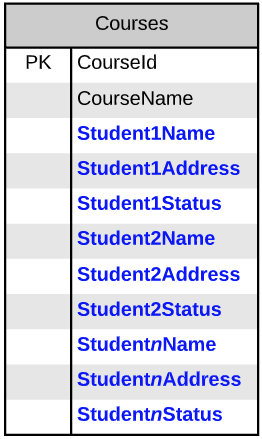

The repeating Student information violates First Normal Form (1NF).  

As there is no existing table in which to place Student information, we will create a new table, assign it a primary key, establish it's relationship to existing tables (shown later) and place the Student information there:

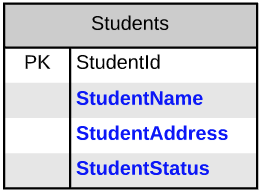

Maybe the Cohort information should go in the Locations table since Locations host Cohorts:

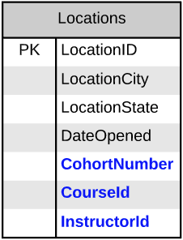

Including Cohort information in the Locations table violates Second Normal Form as the CohortNumber, CourseId and InstructorId for a Cohort are not a fact about the primary key (LocationID) of the Locations table.  A location can have many Cohorts with varying combinations of courses and instructors.  The CohortNumber, CourseID and InstructorID do not depend on the Location.

As there is no existing table in which to place Cohort information, we will create a new table, assign it a primary key, establish it's relationship to the existing tables and place the Cohort information there:

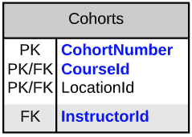

Since the **InstructorId** is not required to uniquely identify a cohort is not part of the Primary Key for the Cohorts table.  **InstructorID** is a Foreign Key to the Instructors table and establishes the relationship between Cohorts and Instructors.

The new Cohorts table seems like a good place for Duration:

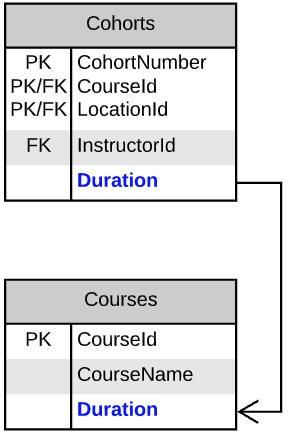

Placing the course Duration in the Cohorts table violates Third Normal Form. Although each Course taught during a Cohort at a Location does have a Duration, thus making duration a fact about the Primary Key. Duration is a fact about a Course regardless of the Cohort or location, therefore it is fact based on only part of the Primary Key and not the entire Primary Key.

We have a table already defined to hold information related to a Course, so we will move Duration to the Courses table where it is a fact about the key, the whole key and nothing but the key.

### **Verify Integrity**

Integrity Rules should be applied to verify the validity your design:

**Entity Integrity Rule**: The primary key cannot contain NULL. Otherwise, it cannot uniquely identify the row. For a composite key made up of several columns, none of the columns can contain NULL.

Most of the RDBMS check and enforce this rule.

**Referential Integrity Rule**: Each Foreign Key value must be matched to an entire Primary Key value in the table referenced (Parent table).

You can insert a row with a Foreign Key in the Dependent table only if the value exists in the Parent table.
If the value of the Primary Key changes in the Parent table (e.g., the Primary Key value is updated or row is deleted), all rows with the matching Foreign Key in the Dependent table(s) must be considered or handled accordingly. Options include:

 1. Disallow the change to the Primary Key.

 2. Cascade the change to the Primary Key by changing all the matching Foreign Keys in all dependents
 3. Delete the matching dependent rows.
 4. Set the Foreign Key value in the matching Dependent Tables rows to NULL.  This can be done only if the Foreign Key is not part of the Primary Key of the Dependent table (see Entity Integrity Rule).

Most RDBMS can be setup to perform the check and ensure the referential integrity, in the specified manner.

**Business Logic Integrity**: There could be integrity (validation) pertaining to the business logic, e.g., zip code shall be 5-digit within a certain ranges, delivery date and time shall fall in the business hours; quantity ordered shall be equal or less than quantity in stock, etc.

These could be carried out in RDBMS managed validation rules (for the specific column) or programming logic.

Final Design:

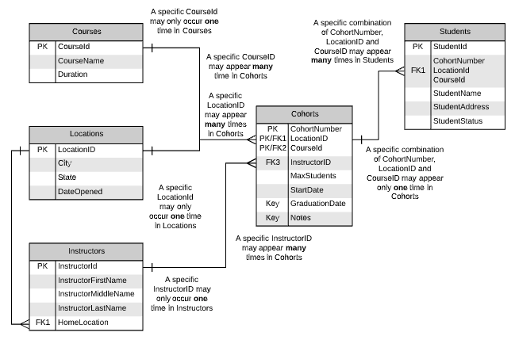

Notes regarding final design:

1. All tables are in Third Normal Form and are in one-to-many relationships.

2. The *Instructor/Location* relator table became the *Cohorts* table after consideration of the columns belonging in it.

3. The *Instructor/Course* relator was discarded as the relationship it supported is handled by the *Cohorts* table.

4. Number of enrollments and number of students graduating for a course in particular cohort at a specific location was not stored as these values can be easily derived from the *Students* table.

5. Business Logic rules/constraints were not considered.

### **Crow's Foot Notation**

Crow's foot notation is often recognized as the most graphically intuitive style for relationship notation and is widely used to document in Entity Relationship Diagrams (ERD),

### **Cardinality and Ordinality**

**Cardinality** refers to the maximum number of times an instance in one entity can relate to instances of another entity.

**Ordinality** is the minimum number of times an instance in one entity can be associated with an instance in the related entity.

Cardinality and Ordinality are shown by the styling of a line and its endpoint:

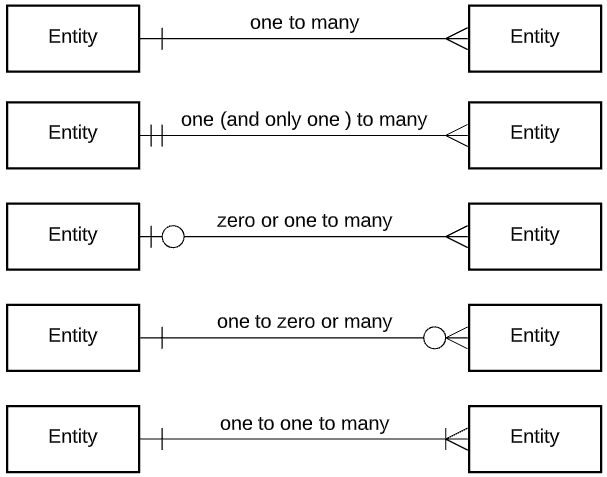

## Summary

Relational Data is widely used in today's world.  A proper and correct design of the Database is critical to the effectiveness of a Relational Database system.

The Relational Database Design process is sometimes ignored because it is very easy to create tables and it seems that "tables are easy".  It is not uncommon to see a very disorganized set of unrelated tables in a supposedly Relational Database.

Relational Database Management Systems (RDBMS) will allow the definition of Databases that do not follow the rules of the Relational Model.  Databases implemented outside the Relational Model will work in an RDBMS, but performance and ease of use generally suffer.

Proper Relational Database design is relatively straightforward and easy.  The benefits of doing it and implementing a good design far outweigh the time that is thought to be saved by not doing it.  Much more time is spent attempting to rectify the issues caused by implementing a Database with a bad or non-existent design.  
