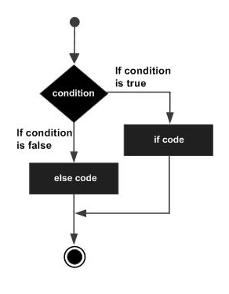

<link rel="stylesheet" type="text/css" media="all" href="./styles/style.css" />

# Expressions, Statements, Blocks, and Branches - Lecture Notes
##### (04/11/2018)

## **Classroom Preparation**

1. [Comparison Operators](http://book.techelevator.com/java/logical-branching/boolean-expressions/05-comparison-operators.html)
2. [Logical Operators](http://book.techelevator.com/java/logical-branching/boolean-expressions/10-logical-operators.html)

## **Overview of Session**
In the real-world many times we want to conditionally perform an action (e.g. a trigger occurred, a threshold has been reached, etc.).

How can we use what we learned yesterday with programming to conditionally execute code based on certain conditions being met?

## **Customary schedule for session:** 

* Expressions, Statements, and Blocks
* [Comparison Operators](http://book.techelevator.com/java/logical-branching/boolean-expressions/05-comparison-operators.html)
* [Logical Operators](http://book.techelevator.com/java/logical-branching/boolean-expressions/10-logical-operators.html)
* [Conditional Statements](http://book.techelevator.com/java/logical-branching/conditional-code/01-conditional-code.html)
* [Introduction to Methods](http://book.techelevator.com/java/logical-branching/methods/01-methods.html)

## **Session Objectives:** 

* Explain the what types of things can comprise an `expression`
* Define what is meant by a `statement` in a programming language
* Describe the purpose and use of a `block` in reference to a programming language
* State what is meant by a `boolean expression` and how it is used in a program
* List the various `comparision operators` available in Java / .NET and the purpose of each
* List the `logical operators` available in Java / .NET and the purpose of each 
* Explain how a `Truth Table' can help in understaning complex conditional expressions


## **Topic List w/Notes** <div class=topicNote>(and <span class='link'>links</span> to e-book section when available)</div>
> Write on white board: **`var text = 5;`**

### Expressions and Statements

When we write code we write expressions and statements.

<div class="definition note">An <span>expression</span> is a construct made up of variables, operators, and method invocations, which are constructed according to the syntax of the language, that evaluates to a single value.
</div>

<div class="definition note">A <span>statement</span> forms a complete unit of execution.</div>

<div class="analogy note">Statements are roughly equivalent to sentences in natural languages</div><br/>

The following types of expressions can be made into statements when they are terminated with a **`;`**:

* Variable declaration e.g. **`int x;`**
* Assignment Expressions e.g. **`int x = 5 + 1;`**
* Any usage of ++ or -- e.g. **`x++;`**
* Control Flow Statements
* Method Invocations
* Object Creation Expressions

### [Blocks](http://book.techelevator.com/java/logical-branching/blocks/01-blocks.html)

Code that needs to belong together as a single unit can be written in **blocks**.

<div class="definition note">A <span>block</span> of code permits multiple statements to be grouped together.</div><br/>

Blocks have a list of statements within them and are enclosed with curly-braces **`{..}`**

<div class="caution note">Be careful introducing the concept of <span>scope</span>. This will move to day 4, if it comes up, make it clear that variables declared 
within a block cannot be accessed outside of that block and variables declared in outer blocks can be seen inside of the inner block.</div> 

### [Boolean Expressions](http://book.techelevator.com/java/logical-branching/boolean-expressions/01-expressions.html)

In programming we often want to conditionally execute sections of code. Before we can do that we need to know how to check when we should run a section of code.

<div class="definition note">A <span>boolean expression</span> is an expression that produces a boolean value (**true** or **false**) when evaluated</div>


#### [Comparison Operators](http://book.techelevator.com/java/logical-branching/boolean-expressions/05-comparison-operators.html)

#### [Logical Operators](http://book.techelevator.com/java/logical-branching/boolean-expressions/10-logical-operators.html)

##### Truth Tables

The following truth tables should be written on the white board in a place that can be left up for a few days until students are comfortable with these expressions.

| `a` | `b` |`!a` | `a && b` | <code>a &#124;&#124; b</code> | `a ^ b` |
| :-: | :-: | :-: | :------: | :---------------------------: | :-----: | 
| **true**  | **true**  | false | true  | true  | false |
| **true**  | **false** | false | false | true  | true  | 
| **false** | **true**  | true | false | true  | true  | 
| **false** | **false** | true | false | false | false |

### [If Statements and Blocks](http://book.techelevator.com/java/logical-branching/conditional-code/01-conditional-code.html)

<div class="definition note">Conditional blocks allow a program to take a different path depending on some condition(s) determined while the program
is running.</div>



#### Ternary Operator

1. If else when assigning a value can be shortened

```
variable = (if-condition) ? if-value : else-value;
```

### [Introduction to Methods](http://book.techelevator.com/java/logical-branching/methods/01-methods.html)

Introduce Methods as a concept to students so that they can understand how to do their homework.

<div class="definition note">A <span>method</span> is similar to a mathematical function. The output of it is often directly correlated to the input of it
(e.g. **`f(n) = n^2`**)</div> <br/>

Methods have
1. Descriptive Names
2. Return Type such as int, bool, float, decimal, etc.
3. Input parameters. Parameters are like variables with values.

> ## Instructor Led Exercise
>
>- [Java Lecture](https://bitbucket.org/te-curriculum/m1-java-expressions-and-control-flow-lecture)
>- [.NET Lecture](https://bitbucket.org/te-curriculum/m1-csharp-expressions-lecture)
>

## Student Exercises (Individual & Pair)

- [Java Individual Exercises](https://bitbucket.org/te-curriculum/m1-java-expressions-and-control-flow-exercises)
- [Java Individual Exercises Solutions](https://bitbucket.org/te-curriculum/m1-java-expressions-and-control-flow-solutions)
- [.NET Individual Exercises](https://bitbucket.org/te-curriculum/m1-csharp-expressions-exercises)
- [.NET Individual Exercises Solutions](https://bitbucket.org/te-curriculum/m1-csharp-expressions-solution)


## Cheat Sheets & References

| Applies To | Reading Link |
|------------|--------------|
| Java       | [Summary of Operators](https://docs.oracle.com/javase/tutorial/java/nutsandbolts/opsummary.html) |
| Java       | [Operator Precedence](https://docs.oracle.com/javase/tutorial/java/nutsandbolts/operators.html) |

## References
N/A
