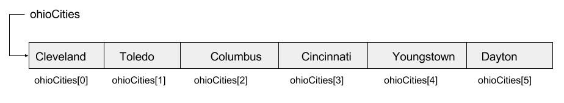
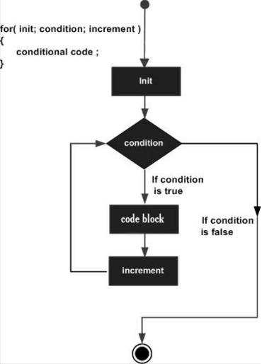

<link rel="stylesheet" type="text/css" media="all" href="./styles/style.css" />

# Loops and Arrays - Lecture Notes
###### (04/11/2018)

## **Classroom Preparation** 

1. Draw For-Loop Diagram on Whiteboard

## **Overview of Session** 
[Link to overview in e-book](http://book.techelevator.com/java/arrays-and-loops/01-intro.html)

## **Customary schedule for session:** 

* [Arrays](http://book.techelevator.com/java/arrays-and-loops/arrays/01-arrays.html)
    * Declaring and Initializing Arrays
    * Elements and Indexes
    * Array Length
* [Intoduction to Loops](http://book.techelevator.com/java/arrays-and-loops/loops/01-loops.html)
    *[For-Loops](http://book.techelevator.com/java/arrays-and-loops/loops/05-loop-syntax.html)
    * [Looping Through an Array](http://book.techelevator.com/java/arrays-and-loops/loops/10-looping-through-arrays.html)
    * [Breaking a Loop](http://book.techelevator.com/java/arrays-and-loops/loops/15-breaking-loops.html)
* [Manipulating an Array](http://book.techelevator.com/java/arrays-and-loops/loops/20-whats-next.html)
    * Add a new item to the end of an already full array
    * Insert a new item into the middle of an array
    * Remove an item from an array
* Variable Scope
* Increment / Decrement Shorthand Assignment
* Breakpoints and Debugging

## **Session Objectives:**

* Explain the concepts of arrays
* Perform the following tasks associated with arrays:
    * Create an array
    * Initialize an array
    * Retrieve/Process values stored in an array
    * Set/Change values in an array
    * Use a for-loop to "walk-through" the elements in an array
* Explain the limitations when using arrays
* Describe how to perform the following manipulations on arrays:
    * Add a new item to the end of an already full array
    * Insert an item into the middle of an array
    * Remove an item from an array
* Explain the concepts related to variable scope and why it is important
* Use the increment/Descrement short assignments properly in a program
* Successfully utilize basic breakpoint and debugging facilities of an IDE.

## **Topic List w/Notes** 
(and links to e-book section when available)

### [Arrays](http://book.techelevator.com/java/arrays-and-loops/arrays/01-arrays.html)

An array is a series of objects of which all are the same size and type. Each object in an array is called an element.

1. [Declaring Arrays](http://book.techelevator.com/java/arrays-and-loops/arrays/05-declaring-and-initializing-arrays.html)
2. [Address Array Elements](http://book.techelevator.com/java/arrays-and-loops/arrays/10-elements-and-indexes.html)
3. [Get the length of an array](http://book.techelevator.com/java/arrays-and-loops/arrays/15-array-length.html)
4. Static initialization of an array
5. Assign array references.
6. Loop over an array with a for-loop.

Indicate to the students that arrays can be multi-dimensional. We don't have many uses because there are other approaches, 
but arrays can have multiple ranks (2, 3, etc.)

### [Loops](http://book.techelevator.com/java/arrays-and-loops/loops/01-loops.html)

Often we want to write code run multiple times. There are many different loop patterns. One of the most common is the for-loop:

The [**for-loop**](http://book.techelevator.com/java/arrays-and-loops/loops/05-loop-syntax.html): 

What are the impacts of looping through an array in a sequential order? What happens if the array
has 100,000 elements and the item we are looking for is at the end? There are data structures that help efficiently perform operations that we will learn about.

### Variable Scope

Code that needs to belong together as a single unit can be written in **blocks**.

A block is a group of zero or more statements between balanced braces and can be used anywhere a single statement is allowed.

Blocks have a list of statements within them and are enclosed with braces **`{..}`**

A variable's scope defines where in the program that the variable is valid (i.e. can be referenced). When code execution reaches a point where a variable is no longer referenceable, the variable is said to be *out of scope*.

Rules of Scope:

1. Variables declared inside of a function or block **`{..}`** are local variables and only available within that block.
2. Blocks can be nested within other blocks and therefore if a variable is declared outside of a block, it is accessible within the inner block. 

### Increment / Decrement Shorthand Assignment

1. Short-Hand Notation **`++`** and **`--`**
2. Difference between `x++;` and `++x;`

With prefix, the expression returns the incremented value of the variable. With postfix, the expression returns the current value of the variable
before incrementing it.

3. Shorthand assignment for `x = x + n;` which is **`x += n;`**. This applies to `-=`, `*=`, and `/=`.

### Breakpoints and Debugging

Debugging is the process of locating and fixing bugs or errors in computer program code.

1. Breakpoints

A breakpoint is a marker in our IDE (not a part of our code) that indicates our program should pause execution
when it reaches a set location before continuing

When debugging code, it is best to:

* Locate the breakpoint at the start of the code that you want to validate
* Make a single change, then test. Repeat. 
* Read any error messages that show up 
* Explain your code step by step to another person

## Lecture Code

- [Java Lecture](https://bitbucket.org/te-curriculum/m1-java-loops-and-arrays-lecture)
- [.NET Lecture](https://bitbucket.org/te-curriculum/m1-csharp-loops-arrays-lecture)

### Student Exercises

- [Java Individual Exercises](https://bitbucket.org/te-curriculum/m1-java-loops-and-arrays-exercises)
- [Java Individual Exercises Solutions](https://bitbucket.org/te-curriculum/m1-java-loops-and-arrays-solutions)
- [.NET Individual Exercises](https://bitbucket.org/te-curriculum/m1-csharp-loops-arrays-exercises)
- [.NET Individual Exercises Solutions](https://bitbucket.org/te-curriculum/m1-csharp-loops-arrays-solution)

## References

[This is a deprecated link from original Lecture Notes](https://msdn.microsoft.com/en-us/library/aa288453(v=vs.71).aspx)
