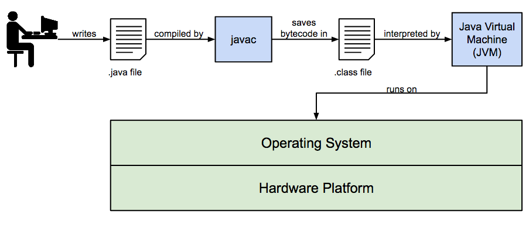

# Introduction to Java

## What is Java?

Java is a computer programming language.

* Object Oriented
* Syntax Derived from C/C++
* Portable (Can run on multiple platforms)
* Interpreted (Source code is generated into Bytecode, which is interpreted at runtime to run on the JVM)
* Has a Standard Library

## Where did it come from?

* Developed at Sun Microsystems by James Gosling
* Originally called “Oak”
* First released in 1995
* Intended for consumer electronics
* Gained popularity for the Web

## Relationship with other languages

* C/C++
    * Similar syntax
    * Java Eliminated undesirable features
* JavaScript
    * Originally developed by Netscape in 1995 as “LiveScript”
    * No technical relationship
* C#
    * Released by Microsoft with .NET platform in 2000
    * Similar features and syntax

## Architecture



* JVM could be implemented in any language, but the Oracle version is C
* There are multiple JVM implementations
* javac is written in Java
* Java code is meant to be read and interpreted by humans (and javac)
* Byte code is optimized and meant to be interpreted by the JVM (i.e. computer)

## Hello World!

Before moving into the development environment, write the Hello World! program.

Create a directory on the computer to run the write the program from.
 
1. Create an empty text file called `HelloWorld.java`
2. Open the text file up in a text editor and write the contents of the below code snippet.
```java
package com.techelevator;

public class HelloWorld {
    public static void main(String[] args) {
        // Prints out Hello World
        System.out.println("Hello World");
    }
}
```

| Code | Description |
|------|-------------|
| `package com.techelevator` | Indicates to the compiler that our code will live in the `com.techelevator` namespace. |
| `public class HelloWorld` | Java programs are made up of one or more classes which hold program code. |
| `public static void main(String[] args)` | The entry point when programs that we write are executed run |
| `{...}` | Encloses a set of commands. For each opening brace there is a closing brace | 
| `// Prints out Hello World` | Comment code that is not executed and provides information to the developer |
| `System.out.println("Hello World");` | Command to write code out to the console (e.g. command prompt). |

We can compile our code using the **Command Prompt** but that is a little tedius. We're going to use **Eclipse**.

## Introduction to Eclipse

Only the hardcore developers work within a text editor and many choose to work within a integrated development environment.

<div class="definition note">An <span>integrated development environment</span> or IDE is the one-stop shop that developers use to write, compile, 
test, and debug code.</div>

IDEs help by:

* organizing code into projects and solutions
* providing immediate feedback on syntax errors 
* code assistance through intellisense
* support suspending a program to step through and debug code

<div class="definition note">A <span>project</span> includes a reference to one or more code files that belong to a module. Multiple types of projects</div>

We can create multiple types of projects:

* **Java Project** allows us to write out to and read from a command line / terminal
* **Dynamic Web Project**
* **Maven Project** 
* **JPA Project**

### Getting Around Eclipse

Walk the students through the following in Eclipse

1. Creating a new Java Project
2. Writing the Hello World Application in the Java Project
3. Running the application and then running as debug
4. Using Intellisense. Command+Space brings up options. Tab / Enter auto-completes.  
5. Parentheses, curly-braces, quotations auto-close