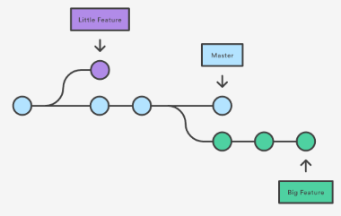
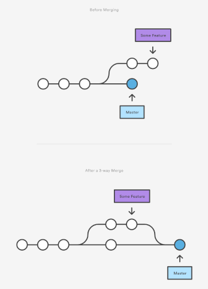

<link rel="stylesheet" type="text/css" media="all" href="./styles/style.css" />

# Merging & Branching w/Git

## Problem Statement

Using Git as a personal repository for version control is helpful to store and track your own changes (and revert when necessary). 
It becomes really powerful when used as a collaboration tool with other developer teams. 

## Classroom Preparation

| Command                      | Description                                              |
|------------------------------|----------------------------------------------------------|
| `git checkout <commit-id>`   | Checks out a previous commit (read-only operation)       |
| `git checkout <branch-name>` | Switches the working directory to branch-name            |
| `git revert <commit-id>`     | Undoes commit by applying a new one                      |
| `git branch`                 | Get a list of all branches                               |
| `git branch <name>`          | Create a new branch                                      |
| `git branch -d <name>`       | Delete a branch (only if all changes are merged)         |
| `git branch -D <name>`       | Permanently deletes a branch                             |
| `git merge <branch-name>`    | Merges branch-name into the currently checked out branch |
| `git log --graph`            | Graphs the commit history for the repository             |

## Daily Objectives

* Git Branches
* Git Merging
* Git Reverting
* Git Remotes

## Notes and Examples

### Commit IDs

1. Every new commit is assigned a generated commit hash id for uniqueness.

The HEAD pointer determines your current working revision. When we look at a previous commit in Git we are in <em>detached HEAD state</em>
 

### Git Branches

1. Developers often work in separate branches to create new features and fix existing bugs.

A <strong>branch</strong> is an independent offshoot of development that occurs apart from the <em>master</em> repository.
 

2. Files added or committed while in a branch are recorded against the **checked-out** branch.

3. *Benefits of interacting with a branch?*
    - Isolated feature development
    - Minimal ongoing changes while trying to developed
    - Helps reduce unstable code from interfering

4. The *master* branch often has a pristine-working version of the application.

5. Changes from the branch are merged back into the *master* repository once verified it successfully works.

6. **`git branch`** and **`git checkout`** commands are used to create branches and check out working branch versions.

**Practice creating new branches, checcking them out, and deleting them.**

### Git Merges

1. Features or changes are often merged from one branch to another.

2. Git tries to merge automatically when the **`git merge <branch-name>`** command is used.      

3. Git applies two different merge algorithms: **fast-forward** and **3-way merge**

### Fast-Forward Merge

A <strong>fast-forward merge</strong> occurs when there is a linear path from the current branch tip to the target branch. All that git does to merge 
is *fast-forward* the current branch history to the target branch history.

1. If we think of a remote repository as another branch, then fast-forward merges often occur our partner pushes updates to the remote that we pull.

**Practice making some fast-forward merges**

### 3-Way Merge

1. Fast-forward merges don't always work. If the commit history of two branches have diverged and there is no linear path from the current branch to the target then a three-way merge occurs.

The <strong>3-way merge</strong>, occurs if the both branches have had additional commits since the code diverged.

2. Both branches receive a new commit. 
    - The new commit has two-ancestors, one from each branch.

### Handling Merge Conflicts

1. When a conflict occurs Git may not be able to determine which version to use.

A <strong>merge conflict</strong> occurs when multiple commits reference the same file and force us to explicitly include changes from a particular commit.
  

2. If both branches that are being merged have changed the same part of a file, Git will not be able to determine which version to use.

3. As a result, it will stop before the merge commit and force us to perform the merge manually.

### Git Reverting

1. Use the `git checkout <commit-id>` command to look at a previous checkout. **read-only operation**

2. `git checkout <commit-id> <file-name>` allows us to look at a file in its previous state.

3. `git revert` actually can undo a committed snapshot. It doesn't remove it from the history, it determines what to get rid of and creates a new commit.

 

 
## Instructor Led Exercises

**https://bitbucket.org/te-curriculum/git-branching-and-merging-lecture**

##Individual/Pair Exercises

## Supplementary Materials and Student Reading