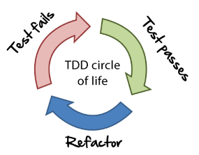

<link rel="stylesheet" type="text/css" media="all" href="./styles/style.css" />

# Test Driven Development

## Problem Statement

When faced with a complex or difficult feature to develop, thinking about the problem entirely up front can consume a significant amount of time.

The agile mantra focuses on rapid iterative changes to see progress in the right direction. If we write code that we "think is right" 100% and then 
write unit tests, what are we likely to do? 

Could we take a different approach and develop a test first that dictates what outcome we want to occur or expect?

## Objectives

* Test Driven Development
* Refactoring
* TDD Strategy
* Katas

## Instructor Led Problem

1. Convert Arabic to Roman Numerals

## Outline

1. **Unit Testing**

**Unit Testing** relies on code that validates the correctness of our program using some assumptions.

2. **What are outcomes of unit testing last?**
    - biased results
    - run of time
    - likely to ignore or miss some of the tests

3. **Test Driven Development**
    

**Test Driven Development** is a development methodology where developers write a feature test that initially fails before writing production
code that implements the feature.

3. **TDD Benefits**
    - Program for specific conditions 
    - Baby steps towards solving a problem, incrementally adding code
    - Refactoring with new patterns
    - Previous tests hold value with each modification

4. **TDD Circle of Life**
    1. Write failing test
    2. Make test pass with minimum code
    3. Refactor

5. **About Refactoring**

**Refactoring** introduces modifications to the code intended to improve the structure or design without changing functionality.
 
 
6. **Simple Ways to refactor**
1. Eliminate duplicate code
1. Extract a method by breaking down long difficult methods
2. Extract complex operations to variables
3. Introduce constants for magic numbers
4. Simplify conditional expressions

### A General Strategy for TDD

1. Create a list of tests needed. 
2. Start by writing just enough test code
3. Always run the test to see it fail in the way you expect
3. Write enough code to make the test build
4. Write enough code to make that test pass (possibly by faking it).
5. When the implementation is obvious then that can be typed in but go back to #4 if not
5. Generalizing the code by eliminating code duplication or reducing dependencies

TDD allows developers to write code in ultra-small steps. Its not necessarily practical but it helps when trying to troubleshoot or develop a complex feature.

## Instructor References

* [Refactoring Techniques](https://sourcemaking.com/refactoring) 
