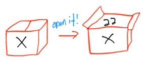

<link rel="stylesheet" type="text/css" media="all" href="./styles/style.css" />

# Variables and Data Types - Lecture Notes
###### (04/11/2018)

## Classroom Preparation

1. Hello World Program on the Whiteboard
2. Data Types

## **Overview of Session**

We'll be writing our first program today.

[Link to e-book section on Variables and Data Types](**Overview of Session**)

## **Session Objectives:** 

* Explain the fundamental concepts and components of the Java or .Net Framework
* Describe the difference bewteen variables and constants and when each should be used in a program
* Properly declare variables in a program
* Use industry acceptable naming conventions for variables
* Identify the primitive data types and their properties
* Utilize arrithmetic operators to form mathematical expressions
* Explain the concept of data conversion, when it occurs and why it is important to understand it
* Explain the purpose and use of literal Suffixes to explicitly indicate the data type for a literal.
* Successfully code and test a simple Java or .NET program using a Interactive Development Environment (IDE).
* Perform simple tasks in an IDE such as:
    * Organizing code into projects
    * Obtain immediate feedback on syntax errors
    * Utilize the "intellisense" feature of an IDE to assist in code development.
    * Perform rudimentary debugging functions on a program

## **Customary schedule for session:**
### Morning

* [Variables](http://book.techelevator.com/java/05-introduction-to-programming/variables/01-variables.html) and [Constants](http://book.techelevator.com/java/05-introduction-to-programming/variables/25-constants.html)
* [Declaring a variable](http://book.techelevator.com/java/05-introduction-to-programming/variables/10-declaring-variables.html)
* [Naming Conventions](http://book.techelevator.com/java/05-introduction-to-programming/variables/15-naming-variables.html)
* [Data Types (int, double, String, boolean)](http://book.techelevator.com/java/05-introduction-to-programming/variables/05-data-types.html)
* [Assiging a variable a value](http://book.techelevator.com/java/05-introduction-to-programming/variables/20-assigning-values-to-variables.html)
* [Expressions](http://book.techelevator.com/java/05-introduction-to-programming/expressions/01-expressions.html)
* [Arithmetic Operators](http://book.techelevator.com/java/05-introduction-to-programming/expressions/05-arithmetic-expressions.html)
* [Literal suffixes](http://book.techelevator.com/java/05-introduction-to-programming/type-conversion/05-literal-suffixes.html)
### Afternoon

* [Introduction to Java](Variables-and-Data-Types-Java.md) / [Introduction to .NET](Variables-and-Data-Types-.NET.md)
* Hello World!
* Your IDE
* [Type Conversion](http://book.techelevator.com/java/05-introduction-to-programming/type-conversion/01-type-conversion.html)
* Questions

## **Topic List w/Notes** 
(and links to e-book section when available)

### Java

The following [link to Variables and Data Type - Java](Variables-and-Data-Types-Java.md) which covers:

* Introduction to Java Framework
* Java Hello World Program
* Introduction to Eclipse

### .NET
 
The following [link to Variables and Data Types - .NET](Variables-and-Data-Types-.NET.md) which covers:

* Introduction to .NET Framework
* C# Hello World Program
* Introduction to Visual Studio

### (Both Java and .NET)
### [Variables](http://book.techelevator.com/java/05-introduction-to-programming/variables/01-variables.html) and [Constants](http://book.techelevator.com/java/05-introduction-to-programming/variables/25-constants.html)

A variable is a storage container paired with a symbolic name or identifier. It holds some known or unknown amount
of information referred to as a value. It is used to assign and access the value of data.

A variable is like a box. The name on the outside should tell you what is inside.

#### [Data Types](http://book.techelevator.com/java/05-introduction-to-programming/variables/05-data-types.html)

A bit can have two values. 0 or 1, off or on.

A byte is made up of 8 bits.

Try having the students what number <b>10</b> is. Indicate that in the Base 10 system this is the number 10, but in Base 2 it is the number 2.

#### [Declaration Statements](http://book.techelevator.com/java/05-introduction-to-programming/variables/10-declaring-variables.html)

A declaration statement introduces a new variable or constant. Variable declarations can optionally assign a value in the declaration. Every variable declaration consists of a type and a name.

#### [Naming Rules](http://book.techelevator.com/java/05-introduction-to-programming/variables/15-naming-variables.html)

Camel case is a convention that requires that the first character in the name is lower-case and 
each subsequent word begins with an upper-case character.

    
#### [Constants](http://book.techelevator.com/java/05-introduction-to-programming/variables/25-constants.html)

A constant is a special kind of immutable variable, meaning its value cannot be changed.

#### Strings

A string represents a sequence of zero or more Unicode characters.

* **Declaring a String**
* **Escape Characters**

### [Arithmetic Operators](http://book.techelevator.com/java/05-introduction-to-programming/expressions/05-arithmetic-expressions.html)

#### [Expressions](http://book.techelevator.com/java/05-introduction-to-programming/expressions/01-expressions.html)

An expression is statement of code which can be evaluated to produce a result. We use the result to often
assign the value to another variable or as the input to another expression.

* **Order of Operations**

| Category | Operators |
|----------|-----------|
| multiplicative | `*` or `/` or `%` |
| additive | `+` or `-` |
| assignment | `=` |

* **Assigning a Value from an Expression**
* **Combining Multiple Expressions** 

### [Type Conversion](http://book.techelevator.com/java/05-introduction-to-programming/type-conversion/01-type-conversion.html)

There are two types of casting that occur.

Widening / Implicit Casting occurs when we convert from one type with less size to a type with more size.

Upgrading from a smaller suitcase to a larger suitcase. We have room for all of our items plus additional space

Narrowing  occurs when we convert from a type with more size to a type with less size.

Truncation occurs when you go from larger to smaller and have to lose some of the data in the process.
  

Downgrading from a larger suitcase to a smaller suitcase. If it was packed full, we'll need to truncate or remove some of the data at the end 

### Numbering Systems
 * Base 2
 * Base 8
 * Base 10
 * Base 16 

> ## Instructor Led Exercise
>
> [Java Lecture](https://bitbucket.org/te-curriculum/m1-java-variables-and-datatypes-lecture)
> 
> [.NET Lecture](https://bitbucket.org/te-curriculum/m1-csharp-variables-and-datatypes-lecture)

## Student Exercises (Individual & Pair)

[Variable Naming Practice](https://bitbucket.org/te-curriculum/m1-java-variables-and-datatypes-exercises)

## Cheat Sheets & References

| Reference | Description |
|-----------|-------------|
| [C# Data Types](https://drive.google.com/open?id=0Bz4DHj0l-C66eVpPa0RBbk5TUlU) | C# Data Type Reference | 
| [Visual Studio Cheat Sheet](https://drive.google.com/open?id=0Bz4DHj0l-C66bGF1ejZvMndOVmc) | Visual Studio Cheat Sheet Reference |
| [Java Data Type Conversion](https://drive.google.com/open?id=0Bz4DHj0l-C66MnV4cnRiUm1UYWc) | Java Data Type Conversion Chart |
| [Java Operator Summary](https://docs.oracle.com/javase/tutorial/java/nutsandbolts/opsummary.html) | Summary of Java Operators |
 

## References
N/A