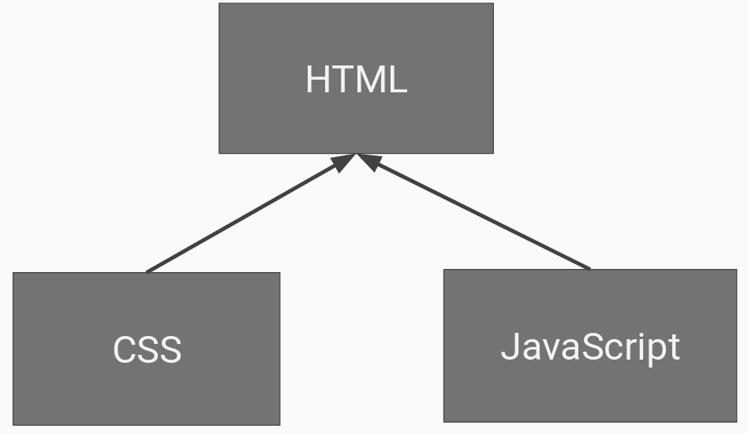
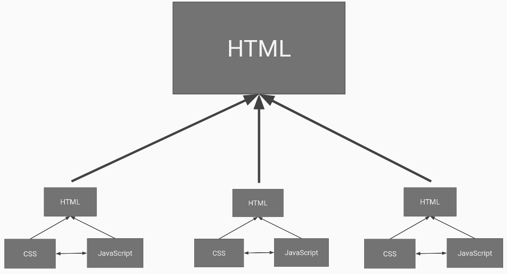

# Introduction to Components-based JavaScript (30 Minutes)

Many of us have worked in JavaScript for many years, using techniques and methods that work well for small bits of functionality on existing web pages and we were happy. But the fundamental uses and methods of JavaScript on the web have changed drastically in the last five years. Our old methods no longer work. Where we were once able to manipulate DOM elements on the fly and add event handlers where ever we wanted, as our front-end applications get bigger and bigger, it has now become too hard to properly separate our code in maintainable modules and properly unit test our code as we write it. We need a new way our JavaScript if we are going to keep up with the changing world of JavaScript.

Component-based JavaScript is an approach to JavaScript development that gives us a new way of thinking about our JavaScript code and gives us back our important programming principles that we lost in the wild, wild west of the '10s.

Instead of thinking of our JavaScript code as separate from our HTML and CSS, injecting itself into our existing web page to manipulate an already functional side, we can start to think of our web page as a collection of components.

## The old way of JavaScript

Normally, we see our web page as one file of HTML, a file containing all of our CSS, and a file of JavaScript.

As each of these files gets bigger and bigger and as we start to think of our web pages as more comprised of reusable parts--like headers, footers, navigation, etc--we start to think of ways to break these files up into smaller, more manageable parts.

Many developers have already done this. Most websites have their header and footer information in separate files so they can be reused throughout a site. CSS is often split up into multiple files using a language like SCSS or LESS and compiled into a single CSS file before being deployed to production. Some people do the same thing with their JavaScript, writing it in different files and then minifying it into one file for a production build.

Does that work the same for JavaScript as it does for CSS? Not really. CSS is a declarative language where each rule is separate from all the other rules. JavaScript is a programming language where a variable, or function, from one file could overwrite a variable from another file. Debugging and troubleshooting a problem like that is not an easy thing to do. JavaScript written in this way is all running in the same big execution space and one poorly behaving piece of code can ruin the entire application.

## The new way of Component-based JavaScript

What we need from JavaScript is what we've had for years in other back-end languages like Java and C#. We need the ability to separate and isolate our functionality so that our code can be well encapsulated. We need to be able to reuse our functionality easily in different contexts on different sites. We need to be able to use functionality in different combinations depending on what problem we're trying to solve. None of these things are easy in traditional JavaScript, but are built into Component-based JavaScript.

In order to take a look at components, we'll need to reconsider how we look at our site overall. Instead of having all of our code in three separate files, we're going to start thinking of having a main HTML page that defines the main content and structure of our page and then include small components made out of HTML, CSS, and JavaScript to act as one single front-end element.

We now see our web page not as a collection of HTML, CSS, and JavaScript but as a collection of components. You can think of components in this model as custom HTML elements. They are a small collection of HTML, CSS, and JavaScript that we include on a page to handle a specific piece of functionality on our site. Which is exactly what a normal HTML element is.

Think about the `<select>` tag. If we include a `<select>` tag in our HTML, that will render to the user in their browser as a GUI dropdown element. If you click the dropdown, you'll see all the `<option>`s that you included in the select element. It has structure, it has data, it has a basic look and feel, and it has behavior. That's a component.

The components we will be making will be more complex than a regular `<select>` element, but the principles are the same. We will be defining new HTML tags that will have structure (HTML), a basic look and feel (CSS), and will contain data and behavior (JavaScript).

So let's build our first component.