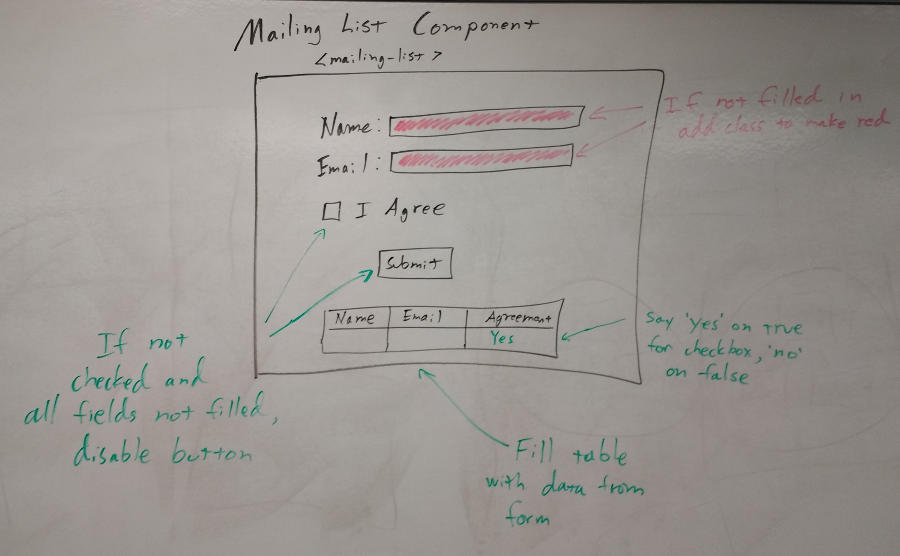

# Day Two Morning Exercise (60 Minutes)

Yesterday, we learned a lot about what it takes to put a component together. Let's use that this morning to build an independent project. We'll be building a very simple component that models a mailing list sign up form.

The requirements that you must meet:

1. The form should take a Name and Email address and have a check box indicating that they agree to sign up for the newsletter.
2. The input boxes for Name and Email should have a red background if they have no content.
3. There will be a table under the form that shows the data that the user has entered for each of the fields.
4. The display value for the checkbox will be 'Yes' if the box is checked and 'No' if it is not checked.
5. The submit button will be disabled until all the input fields have a value in them and the checkbox is checked.