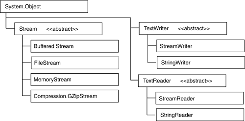
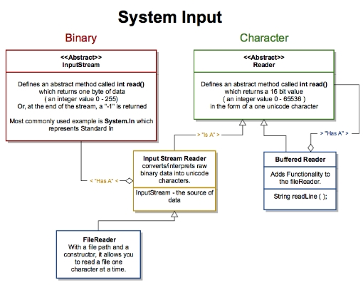

<link rel="stylesheet" type="text/css" media="all" href="./styles/style.css" />

# File I/O - Reading Files - Lecture Notes
###### (04/18/2018)

## **Session Objectives:**
* Descibe the concept of exception handling
* Effectively implement a try/catch/finally structure in a program
* Be aware of `System.IO` namespace (C#) / `java.io` library File and Directory classes
* Explain the difference between streaming and "entire-file" reading
* Demonstrate knowledge of standard File I/O patterns including "Clean-Up"
* List potential exceptions that may be thrown during File I/O processing
* Successfully handle File I/O exceptions in a program
* Enumerate scenarios where File I/O might be used in the "Real World"

## Classroom Preparation
* None

**Overview of Session** 

1. Our problems can't rely on the user to do the right thing. They also can't rely on everything going perfect, there are always variables outside of our control. How can we program accordingly and provide our user with an adequate message when something goes wrong?

2. How do we get our applications to rely on other kinds of input besides user input?

## **Customary schedule for session:** 

* Exception Handling
* Files
* Manipulating Files and Directories
* Reading File Streams
* Garbage Collection
* What Could Go Wrong?

## **Topic List w/Notes** <div class=topicNote>(and <span class='link'>links</span> to e-book section when available)</div>

### Exception Handling

 * [Two different types of errors](http://book.techelevator.com/java/exception-handling/01-intro.html) 
     - Compile-time
     - Run-time

<div class="definition note">

A **compile-time error** occurs when there is a syntactical error or the compiler identifies code that cannot execute (e.g. method does not exist, accessibility not public, redefined constant, type mismatch)
</div>

<div class="definition note">

A **run-time error** occurs while the program is executing. The program often tries to access memory that is inaccessible or may be asked to perform an operation it is incapable of (e.g. access a restricted file, parse a value)
</div><br/>

2. **Exception Handling**
  - used when the code cannot run *as it was intended to run*
  
<div class="definition note">

**Exception handling** is the process of responding to the occurrence during execution of execution anomalies that require special processing. This processing often changes the flow of the program
so that it can recover.</div>

3. **Important Points of Exception Handling**
  - try/catch/finally
  - everything inherits from Exception
  - stack trace
  - checked exceptions (**JAVA**)

--------

### File I/O

1. **System.IO && java.io Library**
  - File, Directory classes

2. **Reading a File**  
  - streaming vs. reading the entire file in at one time

<div class="analogy note">

Methods exist to read all text in very quickly with one line of code. They pull the entire file into memory though. This is equilavent of sitting to watch a netflix movie and waiting for the entire movie to load before you start watching it.
</div>


<div class="definition note">

A **stream** refers to a sequence of bytes that can read and write to some sort of backing data store. 

Streams have an end-of-file marker or end-of-stream marker to indicate when the program reaches the end of the stream.
</div><br/>

3. **System.IO (.NET)**
  - emphasize the `StreamReader`



4. **java.io**
  - Streams allow us to read, write, and seek



5. **Clean Up**
  - using / using w/resources
  - garbage collection doesn't close the connection with files, databases, and other resources
  - we need to explicitly close and free up these resources

<div class="definition note">

Garbage collection automatically releases memory on the heap when a object is no longer referenced and the memory needs to be reclaimed.
</div><br/>

6. **Pattern for reading a file**

```
while (!endOfFile) {
  //read new line
  //do something with line input   
}
```

### Handling exceptions when reading from a file stream
  

Exceptions can often occur when reading streams
1. **Directory not found**
2. **End of stream reached**
3. **File not found** 
4. **Path too long (windows only)** 

## Real World Usage Scenarios

1. Importing Bulk Data Sets
2. Desktop Applications - Reading in Configuration Settings
3. Video Games - Data File
4. Transmitting data to other systems


## Instructor References

[1]:https://msdn.microsoft.com/en-us/library/ms404278(v=vs.110).aspx