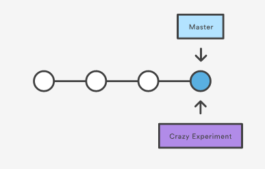
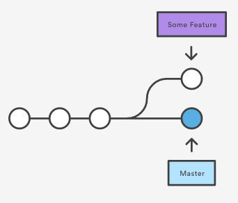
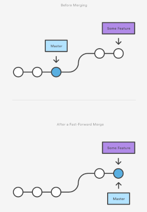
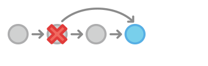

<link rel="stylesheet" type="text/css" media="all" href="./styles/style.css" />

# Merging & Branching w/Git

## Problem Statement

Using Git as a personal repository for version control is helpful to store and track your own changes (and revert when necessary). It becomes really powerful when used as a collaboration tool with other developer teams. 

Today we will learn how we can efficiently work with others on the same code.

## Daily Objectives

* Git Branches
* Git Merging
* Git Reverting
* Git Remotes


## Definitions

* **Branches** are diverges from the main development line that allow us to experiment without altering the main project repository.
* **Branch Tips** are the last or most recent commits on a branch.  
* **Merges** combines the history of two diverged branches or repositories into a single commit history. 
* **Remote Repository / Git Remote** is a repository that you do not individually own. It can be another Git repository on the internet, owned by your company. In short it is is distinct from your locally created repository. 

## Analogies

## Visualizations

| Command                      | Description                                              |
|------------------------------|----------------------------------------------------------|
| `git checkout <commit-id>`   | Checks out a previous commit (read-only operation)       |
| `git checkout <branch-name>` | Switches the working directory to branch-name            |
| `git revert <commit-id>`     | Undoes commit by applying a new one                      |
| `git branch`                 | Get a list of all branches                               |
| `git branch <name>`          | Create a new branch                                      |
| `git branch -d <name>`       | Delete a branch (only if all changes are merged)         |
| `git branch -D <name>`       | Permanently deletes a branch                             |
| `git merge <branch-name>`    | Merges branch-name into the currently checked out branch |


## Notes and Examples

For today's lecture, the students will be working on the shared repository: **https://bitbucket.org/te-curriculum/git-branching-and-merging-lecture**. Students will fork and clone this repository to their local machines.

### Git Branches

Developers are often assigned to the task of adding features to existing code. Often these features may need to be developed in an isolated fashion away from the main code base. 
When developers want to create these features or test them, they perform the action of *branching* the repository.

A **branch** is an independent offshoot of development apart from the main repository. 

Files added or committed while in a branch are recorded against the history of the *checked out* branch. 
This practice of branching limits the amount of interaction with the main code base effectively reducing bugs and the presence of unstable code.

Once a developer completes their feature or the tested code, a common workflow is to merge it back into the *master* branch which holds the golden history of the codebase. 
At some companies, the master repository is expected to always contain a functional working copy of the application.  

Below is a representation of a possible branch:

* Begin by demonstrating the `master` commit history first
* Each commit has a predecessor parent.
* Make a point to indicate that HEAD refers to the tip of the currently *checked out* branch.
* If we wish to checkout a previous commit, we enter *detached HEAD*
* Once a branch is created from HEAD or detached HEAD, the commit history forks and begins going down an independent line.
* Eventually the branch is completed and merged into the `master` branch.
    


We use the **`git branch`** command to create, list, rename, and delete branches.

We use the **`git checkout`** command to check out a previous commit or branch.

#### Listing Branches 

Use the command **`git branch`** to see a list of branches and which one your working directly currently references. 
You can also tell which branch is current in the git command line.

#### Creating a branch

In order to see a list of current branches we use the **`git branch`** command.

To create a branch, we use the command **`git branch <branch-name>`**. The history remains unchanged and we get a pointer to the current commit.

Below is a representation of branch:

* Branches create pointers at the current checked out commit.
* If a previous commit is checked out (*Detached HEAD state*) then a branch is established there. 




#### Navigating Between Branches

To switch between branches, we use the **`git checkout <branch-name>`**. Checking out a branch updates the files in your working directory to match the version stored in the branch history.
It also ensures that Git will record new commits on that branch.



#### Deleting a Branch

The **`git branch -d <branch-name>`** command is used to delete a branch when we are done with it. Once a branch is no longer needed, it is safe to delete it. Branches can remain on your local computer and pushed to a remote if you would like to share them with another developer.


> **Exercise:**
>
> Get a list of the current branches 
>
> **`git branch`**
>
> Creating a new branch called *test-feature*
>
> **`git branch test-feature`**
>
> Get a list of the current branches
> 
> **`git branch`**
>
> Delete the *test-feature* branch
>
> **`git branch -d test-feature`**
>
> Create a new branch called *circle-feature* and check it out.
>
> **`git branch circle-feature`** <br/>
> **`git checkout circle-feature`**
>
> Alternate between the *circle-feature* and *master* branches.
>
> **`git checkout master`** <br/>
> **`git checkout circle-feature`**

### Git Merging

When develoeprs finish features features on separate branches they need to introduce their enhancements back into the main code base.
Often development teams merge back into the *master* branch. Merges bring forked branches together by combining their commit history.

We use the **`git merge`** command, with additional arguments. All merge commands merge *into* the current branch.

> Merge the *circle-feature* branch code into the *master* branch.
>
> **`(master) git merge circle-feature`**

There are two types of merge algorithms used by git. When possible these merges occur automatically but it is possible that conflicts occur.

#### Fast-Forward Merge

A fast-forward merge occurs when there is a linear path from the current branch tip to the target branch. All that git needs to do to integrate
is *fast-forward* the current branch history to the target branch history.

Below is a representation of a *fast-forward* merge:

* The *some-feature* branch is merged into the *master* branch.
* The *master* branch is fast-forwarded to the current commit history of the *some-feature* branch.



> **Exercise**
>
> Checkout the *circle-feature* branch using `git checkout circle-feature`
>
> * Add some changes to the circle-feature branch. Copy *index.html* and name it *circle.html*
> * Update *style.css* and add a style setting for the `.circle` class selector below.
> * Commit the changes to *style.css*.
> * Update *circle.html* and apply the new CSS class to make the rainbow circles page.
> * Commit the changes to circle.html
> 
```css
.circle {
    border-radius: 50%;   
}
```
>
> Switch to the master branch using `git checkout master`. Note that the *style.css* and *circle.html* file are gone. 
> Switch back and forth between the two branches to see the differences, ending up in the *master* branch.
> 
> Merge the *circle-feature* branch into the *master* branch. Notice that it performs a fast-forward merge by going ahead to commits.
>
> **`git merge circle-feature`**
>
> Delete the circle-feature branch.
>
> **`git -d circle-feature`**

#### 3-Way Merge

Another type of merge algorithm, the 3-way merge, occurs if the commit history of two branches has diverged and there is not a linear path from the current branch tip to the target branch tip.
In other words, both branches have had additional commits occur since the code diverged.

This is not a bad thing at all and often very common in the real world. 

The result of the merge is that both branches receive a new commit, one which has two ancestors, the current branch and the master branch.

Below is a representation of a 3-way merge:

* The *some-feature* branch has received some new commits since it was created
* The *master* branch received new commits since the *some-feature* branch was created.
* A new commit is added to the *master* branch in which its ancestor is the previous commit and the tip of the *some-feature* branch.
 


> **Exercise**
>
> Create a new branch called *oval-feature* and check it out.
>
> * Check out the *oval-feature* class.
> * Update *style.css* by adding a new `.oval` class and set its css to the below style.
> * Commit the changes to *style.css*
> * Create a copy of index.html and call it **ovals.html**.
> * Update the *ovals.html* page and use the new class added.
> * Commit the changes to the *oval-feature* branch.
>
```css 
.oval {
    border-radius: 100px / 50px;
    height: 90px;
    width: 180px;   
}
```
> Switch back to the *master* branch using `git checkout master`.
>
> * Update index.html by changing the color of one of the boxes.
> 
> Merge the *oval-feature* branch into the master one. Notice that it opens up the Vim editor window to apply a commit message.
> Once a commit message is provided, your two commit histories will be merged into one single commit.

#### Resolving Conflicts

If both branches that are being merged have changed the same part of a file, Git will not be able to determine which version to use.

As a result, it will stop before the merge commit and force us to perform the merge manually.

> **Exercise**
>
> Creating a merge conflict that requires manual merging. 
>
> * On the feature branch introduce some new files and modify *index.html* by making the first 6 boxes navy. Commit.
> * Checkout the *master* branch. Modify *index.html* by making the first 6 boxes red. Commit.
> * Merge the feature branch into the *master* branch. 
>
> Note that there will be an error. Use `git status` to see which files were both modified.
>
> Open the conflict file and manually select the portions of the file that will remain.
>
> Use `git add .` and `git commit -m` to commit the merged files to the *master* branch.
> 
> Use `git log --graph` to see a visual history of the checkout commits.

### Git Reverting

We can look at previous commits in our repository using the `git checkout <commit-id>` command. **This is a read-only operation**.

If we ever want to take a specific file to its state at a particular snapshot we can use `git checkout <commit-id> <file-name>`. This operation is intended to allow us then to follow the normal git workflow and stage/commit the updates.

The **`git revert`** command has the ability to completely undo a committed snapshot. Instead of removing it from history though, it figures out how to undo the changes from that commit and appends a new commit.

 

> **Exercise**
>
> Select a previous checkout that needs to be reverted.
>
> Apply the **`git revert <commit-id>`** command against it. 
> 
> * If the commit can be automatically reverted it will be done so with a new commit unless `--no-commit` is applied.
> * If the commit cannot be automatically reverted, you will need to manually select the merged file that you want.  

### Git Remotes

Whether we want to push our code to the rest of the world or have a backup in case our local Git repository dies, Git remotes can meet our need. 

Git remotes can be treated just like branches. When interacting with a git remote, it is another copy of your repository. 
This copy you do not own and may experience differences when pushing and pulling updates.

Github and Bitbucket are the two most popular vendors. Github tends to be geared towards public-facing open source projects while Bitbucket is private
enterprise type projects. The main difference is the model for private repositories.

Any changes that happen on a remote will use the merge-algorithms (fast-forward and 3-way) when syncing with your local repository.

We can push branches to remote repositories using **`git push origin --all`** or **`git push origin <branch-name>`** 

 
## Instructor Led Exercises

##Individual/Pair Exercises

## Supplementary Materials and Student Reading