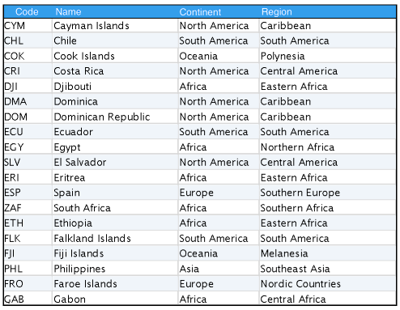

# Introduction to Databases and Querying

## Classroom Preparation

* Write the command for creating a database on the whiteboard in a place that it can stay during the course of the module. 
	```
	createdb -U postgres world
	```
* Write the command for running a SQL script on the whiteboard in a place that it can stay during the course of the module.
	```
	psql -U postgres -d world -f world.sql
	```
* For C# students, use SSMS to create the new database. Create and delete the database a few times so that they understand how to do this on their own.

## Problem Statement
Databases are everywhere, from the largest enterprises that manage employee resources and financial records, to smaller websites that manage customers and members.

* What locations can we think of that might store or house massive amounts of data?*
	* **Netflix, Hulu, YouTube** to track user's history and show preferences
	* **Online Games** to track individual player history
	* **Sports teams** track player analytics
	* **Social Media** to provide recommended businesses, products, friends, etc.

## Lesson Objectives

* Introduction to Databases
* Tables, Rows, and Columns
* Writing SQL Queries


## Notes and Examples

1. **Introduction to Databases**

<div class="definition note">

A **database** is an organized collection of data that can be accessed, managed, and updated.</div> 

<div class="definition note">

Data in a **relational database** can be accessed and reassembled in many different ways without having to reorganize the data.</div>

- Each **entity** is stored in a table.
- Columns are called **attributes**
- **Rows** represent individual records.

<div class="definition note">

**(R)DBMS** software is designed to help manage a database. Its four basic functions are (1) data definition, (2) data storage, (3) data retrieval, and (4) administration.</div>

2. **Common Database Engines**
	- Oracle, SQL Server, MS Access, Postgres, DB2, MySQL

3. **Why might databases be used?**
	- easily support storing large number of records
	- central storage
	- supports structured query syntax to retrieve data
	- enforces consistency and integrity of data	
	- guarantee data type

4. **Sample Database**
- Each column in a database aligns with a data type.
- **ANSI SQL** defines many common data types.
	- char, varchar, nvarchar
	- int, decimal, bigint
	- boolean/bit
	- datetime
	- [W3 Schools List of SQL Data Types](http://www.w3resource.com/sql/data-type.php)



5. **Open up RDBMS**
	- If you haven't shown the students yet, open up their RDBMS
	- How to create and delete databases (via UI)
	- Import scripts
		> **Import the World Database**
		>


6. **SQL**

<div class="definition note">SQL stands for structured query language and is a *declarative programming language* to retrieve and update records from a database.</div>

- SQL consists of:
	- *data definition language* to define the data structures
	- *data manipulation language* to query and modify the data in a database
	- *data control language* to define access to a particular database

7. **Queries**
	- The **SELECT clause** indicates what columns that you want to get from a database table.
	- The **FROM clause** indicates which table(s) to retrieve the data from. 
	
```
SELECT [column], [column-n] FROM [table];	
```

- The **DISTINCT clause** indicates that duplicate values should not be included
- The **AS clause** establishes an alias for a particular column name
    - Can be used for math
	- Also ABS()
- The **WHERE clause** is used to filter the result set using one or more criteria rules.
- Conditional clauses in the WHERE clause can include 
	- `=, <>, !=, >, >=, <, <=` 
	- `IN(values), NOT IN(values)` 
	- `BETWEEN value AND value`
	- `IS NULL, IS NOT NULL` 
	- `LIKE` (with wildcard characters)
- Multiple conditions use AND and OR


### Installing PostgreSQL


* Graphical Installer 9.5.1 `postgresql-9.5.0-1-osx.dmg`
	* Accept all defaults: 
		* Installation Directory: /Library/PostgreSQL/9.5
		* Data Directory: /Library/PostgreSQL/9.5/data
		* Password: ?????
		* Port: 5432
		* Default Locale
* Launch Stack Builder
	* Installation: PostgreSQL 9.5 on port 5432
	* Applications/DatabaseDrivers/pgJDBC v9.4.1208-1
	* Selected Packages: pgJDBC v9.4.1208-1
	* Download directory: ~
	* Do NOT skip installation

* Add the following to your profile

```
$ vi ~/.bash_profile
export PATH=/Library/PostgreSQL/9.5/bin:$PATH
```

* Confirm presence and contents of ~/.pgpass

```
$ cat ~/.pgpass
localhost:5432:*:postgres:WhateverPasswordYouGaveDuringInstallation
```