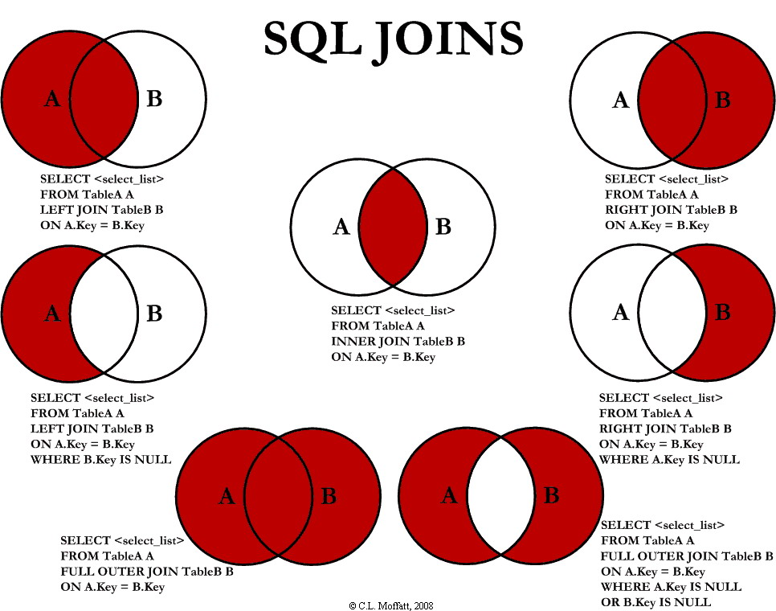

# Keys, JOIN, and UNION

## Problem Statement

Using ORDER and GROUP we can retrieve calculated projections of our data. However our data is still limited in what we can see. Only by JOINING our data using keys can we get the total picture.

## Lesson Objectives

* Keys (Primary, Natural, Surrogate, Foreign)
* Cardinality (1-1, 1-N, N-M)
* SQL Joins (INNER AND LEFT JOIN)
* Unions

## Notes and Examples

> **EXAMPLE - Amazon Scenario**
>
> Imagine a USERS table containing records for each user.
>
> Imagine a SHIPPING_ADDRESSES table containing all shipping addresses for a user.
>
> Imagine a PRODUCTS table containing all product data.
>
> Imagine a PURCHASES table containing all products a user purchases.

1. **Hypothetical Queries**
- What users have shipping addresses in OHIO?
- Which users have brought product X?
- What is the top product sent to INDIANA?


2. **Keys**
	- Keys are used to create relationships between two tables. 
	- Multiple Key Types
		1. **Natural Keys** are formed from values in the real world (e.g. SSN, ISBN, Tax Id, E-mail?)
		2. **Surrogate Keys** are artifically created by the application and identify a unique record.
		3. **Primary Keys** uniquely identify each row within a table. They cannot be duplicated within that table and cannot be null. It is typically a single column but can also be comprised of multiple columns.
		4. **Foreign Keys** exist in other tables and are used to reference a primary key in the source table. 

3. **Cardinality**
	
<div class="definition note">

A **relationship** in a relational database is an association between two tables.</div>

<div class="definition note">

**Cardinality** refers to the maximum number of times that an instance in one entity can be associated with instances in a related entity, along with the minimum number of times it must be associated.</div>
	
<div class="definition note">

A **foreign key** is used to reference records in another table where the primary key is held.</div>	


> **EXAMPLE**
>
> The previous example could be enhanced with an additional table.
>
> The USERS table has a 1-N relationship with SHIPPING_ADDRESSES
>
> The PRODUCTS table has a N-M relationship with USERS.
>
	
### **SQL Joins**

- SQL JOINs allow us to create queries that produce data from one or more tables.
- Related records are "joined" into a single result.
- Joins are referred to as **INNER** and **OUTER**. The tables involved in a JOIN are referred to as LEFT and RIGHT.

<div class="definition note">In an INNER join of table A and B, the result consists of the intersection of A and B. The inner part of a Venn diagram.</div>

<div class="definition note">In an OUTER join of table A and B, the result consists of all records from the LEFT side and any common matches on the RIGHT side.</div>

- INNER JOINs are used to select rows from both tables as long as there is a match between columns in both tables.



```
SELECT table1.column, table2.column 
from table1
[inner join | left join | right join] table2 on table1.column = table2.column;	
```
- OUTER JOINs return NULL where rows are not matched.

### **UNIONS**

- A SQL UNION combines the results of two or more queries into a single result set. 
- The number of columns involved must match exactly and data types must be identical.
- Duplicate rows are removed.

<div class="analogy note">A good example for this is a database that might have faculty and students separated in different tables but we want to return all people who attend or work at a school.</div>	
 
```
SELECT expression1, expression2, ... expression_n
FROM tables
[WHERE conditions]
UNION
SELECT expression1, expression2, ... expression_n
FROM tables
[WHERE conditions]
``` 

