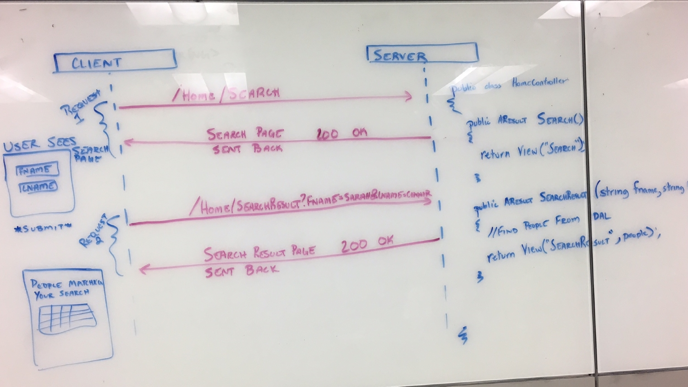
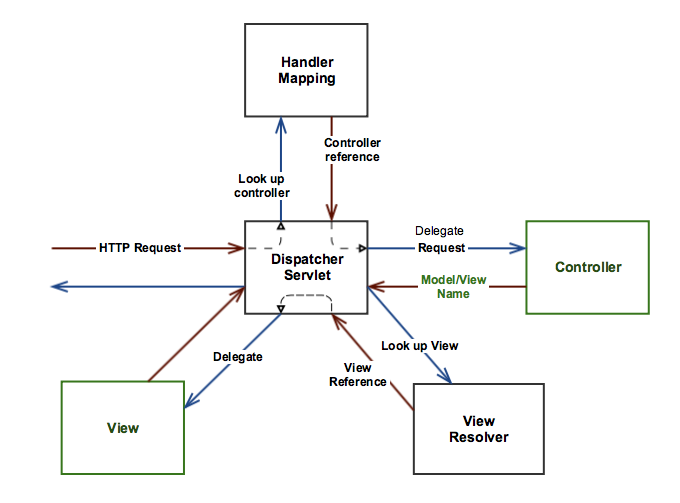
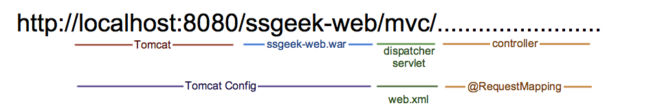

# Forms - Controllers and HTTP GET

This day is a lot. Let the students know that this will take a lot of repitition before they have a handle on everything.

Embrace the black magic and over time parts of it can start to make sense.

## Problem Statement

How do websites with dynamic filters like Amazon.com or eBay work? How would a banking website that displays a calculator (e.g. mortgage calculation or estimated interest) work? 

## Objectives

* Dependency Injection
* HTTP GET Structure
* HTTP GET Usage
* HTML Forms
* Url Encoding
* Controllers and HTTP Get Requests

## Outline

1. **Dependency Injection**
    - **Inversion of Control**
        <div class="analogy note">"Don't call us, we'll call you." - Hollywood Principle</div>

        - [Inversion of Control](http://martinfowler.com/bliki/InversionOfControl.html) is a design principle utilized by many frameworks. In fact, it is the fundamental difference between a *framework* and a *library*.

        <div class="definition note"><span>Dependency Injection</span> is an application of *Inversion of Control* to the instantiation of a class's dependencies. Rather than instantiating it's dependencies directly (i.e. with the `new` operator), dependencies are *injected* at runtime.</div>
        
        - Refers to the fact that *outside code* is in control in the sense that it invokes the code we write, rather than the other way around.
        
        - Example: *The MVC framework invokes our controllers in response to HTTP requests. Our code does not invoke the framework.

        <div class="analogy note">

        CD Players are *dependent* on CDs but they are not built in mind for a single specific CD. That would get boring quickly. You can *inject* the CD into a CD player and each injection will result in a different song heard. The only requirement is that you must inject a CD</div>
    
    - **Dependency Injection Container**
        - Collaborator objects are instantiated by a DI Container

        - Java: Spring has a built in DI Container
        
        - .NET: Ninject

    - **TLDR:** Dependency Injection makes code easier to test.

------

2. **HTML Forms**
    - Two main attributes of a form: **method** and **action**.

    - Methods: GET & POST
        - GET: search forms, calculated pages - anything that fetches data
        - POST: login form, registration page, purchase page - anything that changes data

    <div class="caution note">

    <b>HTTP GET</b> should never modify any data on the server. It is a read-only <b>idempotent</b> operation and should have no effect if called multiple times.</div>

    - All `<input>` elements are added to the request

    ```
    Demonstrate a simple form that submits via HTTP GET
    
        - .NET: Demonstrate using the HTML Helpers
    ```
------

3. **HTTP Requests & Responses**
    - The protocol used by web servers and browsers to communicate.    
        <div class="definition note">

        <b>An HTTP Request</b> is the instructions that the browser or application sends to the web server indicating which resource it needs.</div>    
    
        - Structure of an HTTP Request
        ```
        GET /search?firstname=sarah&lastname=connor HTTP/1.1
        Host: www.techelevator.com
        User-Agent: Mozilla/5.0
        Accept: text/html        
        ```
    - Our browser generates these when a form is submitted. No one would use the Internet if they had to write it by hand.

------


4. **Processing HTTP GET Requests w/Controllers**     
    - **Generating the Requests**

        - The browser generates the request based on the elements on the form.

    - **Processing the Request**

        - The controller responds to HTTP Requests.    
        - A relationship exists between the URL requested in the HTTP GET and a method (called an *action*) in the Controller class          

    

------

5. **Model Binding (.NET Only)**
    - The **Value Provider** collects values from the inbound HTTP request using (form-fields, querystring data, and route data)
    - The **Model Binder** populates primitive and complex data types with these values.

        ```
        public ActionResult SearchProduct(string productId, string productName)
        {
            // do stuff
        }
        //becomes
        public ActionResult SearchProduct(Product p)
        {
            // do stuff
        }
        ```

    - Any action that accepts form-fields, querystring input, or route data can use this and put a model in the place of individual parameters.
    


             
#### Spring MVC

- **Architecture**
    1. Review the Spring documentation on the [request processing workflow](http://docs.spring.io/spring-framework/docs/current/spring-framework-reference/html/mvc.html#mvc-servlet).
    2. Talk about Spring MVC request processing in more detail using the following visualization as a guide
    
    3. Review the concept of a "logical view name"

- **Configuration** 
    - Review `web.xml`
    - Review Spring context configuration in `springmvc-servlet.xml`

- **Controllers and Request Mapping**
    - Review `HelloController.java`
    - Talk about how requests are mapped
    

#### ASP.NET MVC References

- **Architecture**
    1. [ASP.NET MVC Request Lifecycle](https://www.asp.net/media/4773381/lifecycle-of-an-aspnet-mvc-5-application.pdf) 
    2. Request [procesing workflow](http://www.codethinked.com/aspnet-mvc-request-flow) 


## Real World Usage Scenarios

1. Building a Search Page
2. Creating direct links to dynamic content
3. Dynamically render resources (image resources take parameters for size, quality, format, etc.)
4. Create and save dynamic filter

