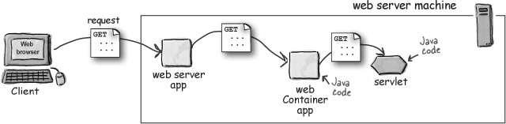
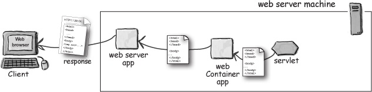

# Introduction to MVC and Views Part 1

## Problem Statement

Use Amazon.com or another representative site to have a conversation about how one might implement such a site.  

- Discussion: *Do you think Amazon has an HTML file for each of their products?*

## Lesson Objectives

- Dynamic Web Applications
- MVC Pattern
- Introduction to JSP / ASP.NET MVC
    - JSTL / Razor

## Notes and Examples

### Dynamic Web Applications

- Review anatomy of an HTTP request
    - Review the process of a web browser making an HTTP request for a web page to a web server , including requests for referenced resources (images, stylesheets, etc) 
        
- Describe the process flow for a web page dynamically generated on the server 

- Describe how applications are deployed inside of a web application server

#### .NET

- **Internet Information Services**
    - Windows 10 installs IIS 10 by default. Support for HTTP, HTTPS, FTP, FTPS is included.
    - IIS Express is a lightweight and self-contained version of IIS for developers
        - It can work with ASP.NET and PHP applications
        - Doesn't require us to have administer rights to perform tasks
    
- **IIS Components**
    - protocol listeners
    - performance monitoring
    - process management
    - request processing
    - application pools

- **ASP.NET Framework**
    - ASP.NET offers three frameworks for web applications: Web Forms, MVC, and Web Pages
    - The framework offers security, request management, session management, configuration management. 
    - **Web Forms** similar to desktop applications and Windows Forms app. Very WYSIWYG heavy.
    - **ASP.NET MVC** is used by development teams interested in patterns and design principles.
    - **ASP.NET Web Pages** is used by hobbyists or as an entry point into ASP.NET. Relatable for PHP developers.

            
#### Java

A Servlet is a Java object that can handle HTTP requests. It is the fundamental building block of Java web applications.

    
- **Walk through HelloServlet** example code

- **Walk through the `web.xml`** file

- Note that building dynamic applications with Servlets directly would be tedious and that we will be building applications using a framework that abstracts us from the low-level details of Servlets.

- **Tomcat**
    - Tomcat is an Open Source Servlet Container
    - Describe how Tomcat maps requests to applications by parsing the request resource path
        - Explain the integration between Tomcat and Eclipse and how to run a web application from Eclipse

A servlet container is a server that can accept HTTP requests and invoke Java objects called servlets in order to generate a dynamic response.

        
- **Web Application Structure**
    - Explain the layout of the Maven directory structure for web applications
        - `src/main/webapp` is the "webroot" of the application
        - `WEB-INF` is a directory that must be included in every Java web application
            - `web.xml` lives here
            - Not accessible to the outside world
 
### MVC Pattern

**Model View Controller** (MVC) is a pattern that divides the application based on responsibility.

- **Model**
    - application state and business logic
    - only part of the application that talks to the database
    - Models could be classes

- **View**
    - presents data to user
    - accepts input from user
    - Views might be a desktop display, a mobile display, a file output based on a model

- **Controller**    
    - Takes input from the view and passes it to the appropriate model objects
    - Grabs all necessary building blocks and organizes them for the output
    - Takes results from the model and passes it to the appropriate view

- The end result is that the Model and View are unaware that the other exists.  This decouples the Model and View.  

- Website Example
    - Model: HTML
    - View: CSS
    - Controller: Browser

- Lego Example
    - Model: Lego Blocks    
    - Controller: Builder with Legos
    - View: Spaceship, tank, house, etc.    

### Introduction to JSP / ASP.NET

#### JSP

- Writing HTML from a Servlet is tedious and error prone
- Java Server Pages were introduced to make it easier to implement dynamic HTML
- JSPs are compiled by the container into Servlets

- **JSP Expression Language (EL)**
    - The JSP Expression Language (EL) was introduced to provide a more limited scripting language for use in JSPs.
        - The limited functionality discourages writing business logic in JSPs
        - Easier for non-Java programmers (e.g. web developers) to use without knowing Java
        - The EL has similar syntax to the Java language but some important differences as well.

    - An EL expression takes the form of `${ EL expression goes here }`

    - EL mostly has the same [operators](http://docs.oracle.com/javaee/1.4/tutorial/doc/JSPIntro7.html) as Java

- **JSTL Tags**
    - The Java Standard Tag Library (JSTL) is a library of tags that provide dynamic behavior
    - In order to use the tag library, you must import it in your JSP page
        - `<%@ taglib uri="http://java.sun.com/jsp/jstl/core" prefix="c"%>`
    - `<c:set />`
        - used for setting "scoped variables"
    - `<c:if />`
        - like an `if` statement from Java but without `else`
    - `<c:choose />`
        - used when we have `if ... else if ... else` logic
        - `<c:when />`
        - `<c:otherwise />`
    - `<c:foreach />`
        - `begin` and `end` attributes can be used to iterate over a series of numbers
        - can also be used to iterate over a collection but we will do that tomorrow
    
#### Razor and MVC

- **The MVC Application Lifecycle**

- Every web application has two main steps, understanding the request, and sending out the appropriate response.

- *Request*
    - Creation of the Request begins with a URL (called a route). 
    - When the request arrives the route maps to a controller and a specific action.
    - The request arrives with additional parameters that are accessible in code (e.g. header values, querystring values)     
- *Response*
    - The action is executed to provide a response.
    - Response are sent back as an Action Result.

**Action Result** is an abstract class. It is the result of an action methods. Results can consist of Views that are rendered (ViewResult), Files, JSON, etc.
   

- **Introducing ASP.NET MVC Web Projects**

    1. **Localhost** All applications that we create are initialized and run off of localhost in a containerized web server.
    2. **web.config** contains configuration settings necessary to running our application.
    3. **Global.asax** is an ASP.NET file that responds to application and system level events raised.
        1. Application_Start
        2. Application_End
        3. Session_Start
        4. Session_End
        5. Application_Error 
    4. **Packages** are additional libraries that are pulled into assist our development of a web site.

**Razor** is a view engine syntax. It is based on the C# programming language.
                

- Razor
    - Code is added using the @ character
        - The @ character starts inline expressions, single statement blocks, and multi-statement blocks                
    - Code blocks are enclosed in curly braces                
    - Inline Expressions allow Razor variable values to be used within HTML        
    - Each statement is ended with a semicolon when inside a block
    - Variables can be created to store values
    - Code is case sensitive
    - We code with objects and access properties and methods on them just as in C#
        - Classes we used in C# are often available in Razor (e.g. Dictionary, List, etc.)
    - We can write code that is conditional and makes decisions
        - We can use an `if` block to branch our code        
    - Comments are observed with an @\* .... \*@
