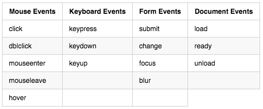

# Handling Events with jQuery

## Problem Statement

In order to create web sites that interact with our users and change the look and feel, we need to respond to events that they trigger on the web page.

## Daily Objectives

* Function Expressions & Anonymous Functions
* Web Page Events
* Event Design Pattern
* Event Handling
    * Attaching Handlers
    * Event Propagation
* jQuery Event Handlers
    * Event Args & this

## Notes & Examples

### Function Expressions and Anonymous Functions

<div class="definition note">

A <strong>Function Expression</strong> assigns a function object to a variable.</div>

<div class="definition note">
An <strong>Anonymous Function</strong> is a function without a name. The function object can be:
    
- assigned to a variable
- stored in an object
- passed as a reference to another function (like an object reference)    
</div>

### Web Page Events

1. **Introduction to Events**
    - *What sample types of events can occur when interacting with a web page?*
        - user click
        - form submit
        - page has loaded
        - textbox has changed value
        - browser resize



### Event Design Pattern

<div class="definition note">

The event system is a programming design pattern. It starts with the kind of event and: 

- the name of the event
- the type of data structure used to represent key properties of the event
- the object that will 'emit' the event
</div>

The pattern is implemented using 
- by defining a function that takes as an argument the data structure
- registering the function as a *handler* with the name of the event on the object that emits the event

### Event Handling

<div class="definition note">Event handlers allow our code the ability to react when an event occurs.</div>

[MDN Standard Event Reference](https://developer.mozilla.org/en-US/docs/Web/Events)


#### **1. Attaching Event Handlers via Javascript**

**Example of registering a listener w/out jQuery**
 
```javascript
var p = document.getElementsByTagName('P')[0];
p.addEventListener("click", function(event) {
    this.innerHTML = "Paragraph Clicked!"; 
});
```

- `this` refers to the DOM element on which the handler was registered
- `event` is includes information about the event type
    - `event.preventDefault()` is used to stop the browser's default behavior on that element (i.e. hyperlink)
- `return` value determines if the event is allowed to propagate further


#### **2. Event Propagation**

<div class="definition note">

<strong>Capture phase events</strong> start at the outermost DOM element and go to the innermost DOM element that received the action.</div>

<div class="definition note">

<strong>Bubble phase events</strong> start at the innermost target DOM element that received the event and then "bubble" up to the main document.</div>


### **jQuery Event Handlers**

**The syntax for adding an event handler to a jQuery object is as follows:**

```javascript
$("[selector]").on('click', function(event) {
    alert("You just got clicked");
    //this refers to the element that was clicked, to get its jQuery 
    //representation we wrap it as a jQuery object
    var element = $(this); 
});
```

Reference **[jQuery Event Handler Reference][1]**

- When an event is invoked the `event` object is passed:
    - **Events** all include the target of the event, the type of event and methods to cancel or stop propagation such as `preventDefault()` or `stopPropagation()`
    - **Mouse Events** include which mouse button was clicked, where the mouse was at when clicked, how many times it was clicked, the element that triggered the event.
    - **Keyboard Events** include if the ALT/CTRL key was held when the keypress occurred, the unicode character representing the key pressed 

## Instructor Led Exercises

- [Lecture Examples](https://bitbucket.org/te-curriculum/m4-jquery-events-lecture)

## Individual/Pair Exercises

- [Java Exercises - History Geek](https://bitbucket.org/te-curriculum/m4-java-historygeek-exercises)
- [C# Exercises - History Geek](https://bitbucket.org/te-curriculum/m4-csharp-history-geek-starter)


[1]:https://api.jquery.com/category/events/
[2]:http://www.w3schools.com/jsref/dom_obj_event.asp
