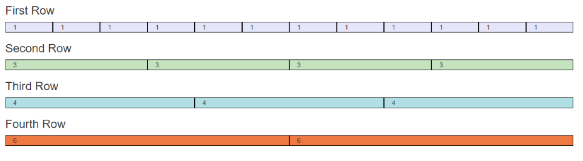

# Responsive UI Design w/Twitter Bootstrap

## Problem Statement

Traditionally to create websites that can support multiple layouts required developers to duplicate code and create multiple versions of the site.

 You might often see a mobile optimized site for a website. Rather than duplicating code we can write an implementation that can change based on the screen size or device type. sizes.

## Daily Objectives

* Responsive Design
* Responsive Grids
* Twitter Bootstrap
* Bootstrap Grid

## Notes and Examples

### Responsive Design

<div class="definition note"><strong>Responsive design</strong> means designing and building a website that properly renders on almost all devices irrespective of the device, browser size, etc. It uses CSS to resize, hide, shrink, enlarge, or move content.</div> 

**Tips for Responsive Pages**

1. Avoid using fixed-width elements (i.e. images wider than the viewport)
2. Do not rely on a particular viewport size
3. Use different CSS styles based on the screen size.

### Responsive Grids

1. **Design for Mobile First**    

2. **Media Queries**
    * `@media only screen and (min-width: 768px) { .. }`
    * `@media only screen and (orientation: landscape) { .. }` 
    * `@media (min-width: 700px) and (orientation: landscape) { .. }`

<div class="definition note"><strong>Media Queries</strong> are a CSS3 concept that allows content rendered to adapt to conditions such as screen resolution or device orientation.</div>

[**Reference to CSS Media Queries**](https://developer.mozilla.org/en-US/docs/Web/CSS/Media_Queries/Using_media_queries)

3. **Meta Width**

    1. HTML5 added the meta viewport to instruct the browser how to control page dimensions.

    ```html
    <meta name="viewport" content="width=device-width, initial-scale=1">
    ```

3. **Grid Columns**

    1. Responsive designs often have views comprised of 12 columns
    2. The total width is 100%

    

### Twitter Bootstrap

1. **Helps Developers Create mobile-first responsive pages**
    1. Held #1 projecct on Github during 2014 Summer
    2. Developed by Twitter

2. **Includes**
    * grid layout
    * typography
    * forms
    * buttons
    * naviation

3. **Installing Bootstrap**
    1. http://www.getbootstrap.com
    2. Bootstrap CDN
    3. Include the CSS, jQuery Library, and Bootstrap Javascript
    4. **.NET** via Nuget

4. **Fixed-Width or Full-Width**
    1. The container needs to hold the grid layout in Bootstrap
    2. `fixed-width` will use a default container size to center the content.
    3. `full-width` will take up all space on the screen.

5. **Responsive Screen Sizes**
    1. Only need to set the smallest screen size supported, it will apply to all of those that are larger

|  Name  | Screen               | Container Width |
|--------|----------------------|-----------------|
|  xs    | phones (*<768px*)    | *auto*          | 
|  sm    | tablets (*>= 768px*) | 750px           |
|  md    | desktop (*>= 992px*) | 970px           |
|  lg    | large desktop (*>= 1200px*) | 1170px   |

6. **Important Tips**
    1. Create the container using **`<div class='container'>`** or **`<div class='container-fluid'>`** 
    2. Use rows to create horizontal groups of columns with **`<div class='row'>`**
    3. Only columns are placed in rows and only content is placed in columns.
    4. The desired number of columns follows this format **`<div class='col-*-*'>`**
    5. Number of columns for each row must add up to 12.


## Instructor Led Exercises

- [Twitter Bootstrap Lecture](https://bitbucket.org/te-curriculum/m4-twitter-bootstrap-lecture)

##Individual/Pair Exercises

- [Twitter Bootstrap Exercises](https://bitbucket.org/te-curriculum/m4-twitter-bootstrap-exercises)


## Visuals Reference
**Desktop**


**Tablet**


**Phone**


