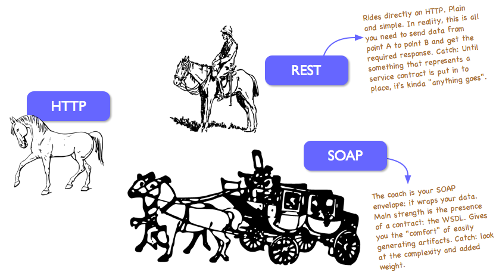

# Building a ReSTful Web Service

## Problem Statement
We've seen how to consume web services written by others using jQuery to add capabilities to our applications.  What if we want to build a web service of our own?

We might feel motivated to create a web service in order to:

1. Enable our user interface to be more dynamic and responsive by using AJAX requests within our pages.
	
2. Expose the functionality of our application to others in a way that they can integrate it into their own applications and mashups.

## Lesson Objectives

1. Web Services
2. SOAP vs REST
3. RESTful Web Service Design
	- Resources
	- HTTP Methods
4. HTML data-* Attributes


## Notes and Examples

### 1. Web Services and Web APIs

<div class="definition note">

A **web service** is a "standardized" way of integrating two web-based applications.</div>

<div class="definition note">

**Web APIs** are a type of service where the emphasis is on simple REST based communications.</div>

<div class="definition note">

**REST** stands for representational state transfer. It is an architectural style used to access and modify resources over standard HTTP methods.</div>

### 2. SOAP vs ReST

#### SOAP

<div class="definition note">

**Simple Object Access Protocol** (SOAP) is a formal specification for building web services. Web Services define SOAP protocol using WSDLs.</div>

| Advantages | Disadvantages |
| ---------- | ------------- |
| Tool Support | Heavy weight and complex |
| Advanced security features (WS-Security) (e.g. message-level encryption) | Very complicated to build in-browser Javascript clients |
| ACID Transaction support (WS-AtomicTransaction) | Data must be represented in verbose XML | 

In practice, very few applications need the advanced features of SOAP such as WS-Security or WS-Atomic Transaction).

#### REST

*Representational State Transfer* (REST) is an architectural style described by Roy Fielding in his doctoral dissertation in 2000.  This architectural style describes the architecture of the World Wide Web and can also be used to build web services.

| Advantages | Disadvantages |
| ---------- | ------------- |
| Lightweight and simple | Less tool support |
| Leverages the technologies and design patterns of the web | Lack of standards |
| Compatible with JSON, making it integrate well with Javascript | |
| Easily maintainable and scalable | |

<div class="analogy note">

Using SOAP is analogous to mailing an envelope while REST is analogous to a postcard. Postcards are easier to handle, consume less bandwidth and have short content. It can be carried over secure connection though.</div>

[**SOAP Message vs. REST Message**](http://whatisrest.com/rest_service_contracts/http_messaging_vs_soap_messaging)

### 3. RESTful Web Service Design

#### Resources

<div class="definition note">

A web **resource** is anything that can be addressed by a URL. The resource is anything that can be stored on a computer.
When a client issues a `GET` request for a resource, the server should serve a document that captures the resource in a useful way. That’s a ***representation***.</div>

<div class="analogy note">

A *resource* in REST could be considered analogous to a *table* in a database and the HTTP methods are analogous to `SELECT`, `INSERT`, `UPDATE`, `DELETE`.</div>

RESTful web services are built using the same principles as the rest of the Web.  As such, they heavily rely on the semantics of HTTP.  

**REST services rely on interacting using NOUNS not VERBS. We interact with collections and single instances**
- GET `Messages/`    
- GET `Messages/{id}`
- POST `Messages/`
- POST/PUT `Messages/{id}`  


#### HTTP Methods

Resources can be acted upon using the standard HTTP methods.  If the resources represent the state of the system, then the HTTP methods represent the action or behavior to expect.

The following four HTTP methods are the ones most commonly used by a RESTful web service. They more or less map to the four "CRUD" (Create, Read, Update, Delete) operations.

- **`POST`** - Create a new resource underneath this one, based on the given representation.
- **`GET`** - Get a representation of this resource.
- **`PUT`** - Replace the state of this resource with the one described in the given representation.
- **`DELETE`** - Destroy this resource.

##### Safe and Unsafe Methods

<div class="definition note">

**Safe HTTP Methods** mean that requests using that method are not supposed to change the state of the system.  The `GET` method is only intended for data retrieval and is therefore considered safe.</div>

`POST`, `PUT`, and `DELETE` are intended to change the state of the system or have other side-effects.  They are therefore considered unsafe.

RESTful web service APIs should honor this definition and should not use `GET` requests to alter the state of the system.

[RFC 2616 - 9.1.1 Safe Methods](https://www.w3.org/Protocols/rfc2616/rfc2616-sec9.html)

##### Idempotent Methods

<div class="definition note">

**Idempontent methods** mean that the effect of calling a method multiple times is the same as calling it once.  The methods `GET`, `HEAD`, `PUT` and `DELETE` share this property.</div>

When deciding what HTTP method is appropriate for a RESTful web service operation, you should consider whether the operation is idempotent and then choose the HTTP method that best fits.

[RFC 2616 - 9.1.2 Idempotent Methods](https://www.w3.org/Protocols/rfc2616/rfc2616-sec9.html)


### 4. HTML data-* Attributes

Use the data-* attribute to embed custom data:

```
<ul>
  <li data-animal-type="bird">Owl</li>
  <li data-animal-type="fish">Salmon</li> 
  <li data-animal-type="spider">Tarantula</li> 
</ul>
```

The data-* attributes give us the ability to embed custom data attributes on all HTML elements.

The stored (custom) data can then be used in the page's JavaScript to create a more engaging user experience (without any Ajax calls or server-side database queries).

The data-* attributes consist of two parts:

1. The attribute name should not contain any uppercase letters, and must be at least one character long after the prefix "data-"
2. The attribute value can be any string

**Note:** Custom attributes prefixed with "data-" will be completely ignored by the user agent.


### Implementing a RESTful Web Service With Spring MVC

#### REST Controllers
The `@RestController` annotation indicates that the data returned by a controller's methods should be converted into JSON (using the Jackson library) and sent in the response body.

#### Jackson
```
<dependency>
    <groupId>com.fasterxml.jackson.core</groupId>
    <artifactId>jackson-databind</artifactId>
    <version>2.5.0</version>
</dependency>
```

#### Using Path Variables
`@PathVariable` annotation


## Visualization

[View Image](resources/rest_vs_soap.png)


## Instructor Led Exercises
Exercises that can be worked out together with students during class.  These should provide examples that the students can refer back to while working on the individual exercises.

##Individual/Pair Exercises
Exercises that are assigned to students for self-study or pair work.

##Supplementary Materials and Student Reading
- [REST-ful URI design](http://blog.2partsmagic.com/restful-uri-design/)